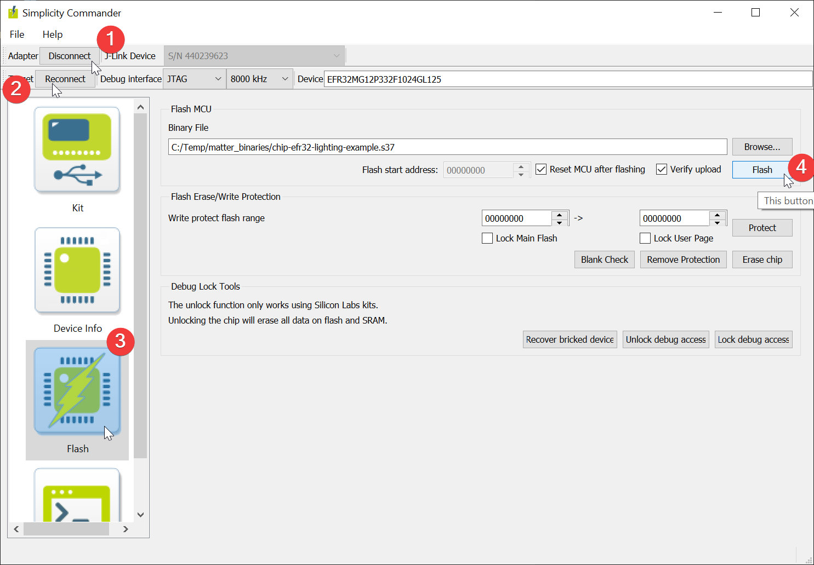

# Building the Lighting App example:

If you followed our prerequisites, you should be in a directory within `~/matter_dev` 

Within this directory you should have a `connectedhomeip` folder 

**This connectedhomeip folder should be a Matter git repository, bootstraped AND activated** 

If you did not have an such folder please go back to prerequisites and perform all steps again

## Building the Lighting App Example:

Start by `cd`ing into Matter SDK folder

```bash
cd connectedhomeip
```

Then simply use the dedicated build script as follows, in one command line:

`./scripts/examples/gn_efr32_example.sh ./examples/<example-app-name>/efr32/ ./out/<example-app-name> <BOARDNAME>`

In our case, a lighting application for Thunderboard Sense 2 (BRD4166A)
```bash
./scripts/examples/gn_efr32_example.sh ./examples/lighting-app/efr32/ ./out/lighting-app BRD4166A
```

If all goes fine, you should see a gcc size report on the freshly built binary:
```bash
+ arm-none-eabi-size -A ./out/lighting-app/BRD4166A/chip-efr32-lighting-example.out
./out/lighting-app/BRD4166A/chip-efr32-lighting-example.out  :
section               size        addr
.text               763472           0
.ARM.exidx               8      763472
.nvm_dummy           72104      763480
.data                 1876   536870912
.bss                115412   536872792
.stack_dummy          1024   536988208
.ARM.attributes         46           0
.comment                77           0
.debug_info       27383652           0
.debug_abbrev      1131760           0
.debug_loc         2407436           0
.debug_aranges       83176           0
.debug_ranges       263552           0
.debug_line        2787435           0
.debug_str         1582456           0
.debug_frame        267924           0
.stab                  180           0
.stabstr               387           0
Total             36861977
```

As you can see, build artifacts are located in `./out/<example-app-name>/<BOARDNAME>/<binary>.s37`

## Flashing the lighting app example

  *  **For Thunderboard Sense 2 (BRD4166A) users ONLY** 

      The first step is to make sure that you flashed a bootloader into your device
      This can only be done using JLinkExe utility or via any flash programming GUI (i.e. Simplicity Studio, or Commander)

      Such bootloader can be built using Simplicity Studio : see [UG266](https://www.silabs.com/documents/public/user-guides/ug266-gecko-bootloader-user-guide.pdf)

      For convenience, we hosted a pre built Internal Storage Bootloader for BRD4166 (Built using GSDK 3.2.4)

      1.  Download the Thunderboard Sense 2 bootloader 
          ```bash
          wget https://www.dropbox.com/s/qqh45vmflw3w8le/bootloader-storage-internal-single-combined-BRD4166A.s37
          ```

      2.  Flash the Bootloader image using JLinkExe **(not available for WSL)**
          If you installed JLink utilities in our prerequisites then you already know how to launch the `JLinkExe` tool :
          ```bash
          JLinkExe -device EFR32MG12P432F1024GL125 -speed 4000 -if SWD -autoconnect 1
          ```
          
          **Note:** If you have several kits connected to your Rpi or computer you will need to pass its JLink serial no otherwise **this will fail**

          Flash the RCP using `loadfile ./bootloader-storage-internal-single-combined-BRD4166A.s37` in the newly opened prompt:
          ```bash
          J-Link>loadfile ./bootloader-storage-internal-single-combined-BRD4166A.s37
          Downloading file [./bootloader-storage-internal-single-combined-BRD4166A.s37]...
          Unable to load library icui18n "Cannot load library icui18n: (icui18n: cannot open shared object file: No such file or directory)"
          JLinkGUIServerExe: cannot connect to X server
          J-Link: Flash download: Bank 3 @ 0x0FE10000: 1 range affected (14336 bytes)
          J-Link: Flash download: Total: 0.523s (Prepare: 0.190s, Compare: 0.005s, Erase: 0.000s, Program & Verify: 0.270s, Restore: 0.055s)
          J-Link: Flash download: Program & Verify speed: 52 KB/s
          O.K.
          J-Link>
          ```
          
          Then reset the device and quit 
          ```bash
          J-Link>r
          Reset delay: 0 ms
          Reset type NORMAL: Resets core & peripherals via SYSRESETREQ & VECTRESET bit.
          Reset: Halt core after reset via DEMCR.VC_CORERESET.
          Reset: Reset device via AIRCR.SYSRESETREQ.
          J-Link>q
          ```
      3.  Flash the Bootloader image using Commander GUI **(not available for Raspberry Pi OS)**
          
          Make sure you have commander installed
          If not, follow the Matter Development Environement Prerequisite section and install commander

          `cp` the bootloader binary to the Windows file system **(FOR WSL USERS ONLY)** :

          ```bash
          mkdir -p /mnt/c/Temp/matter_binaries
          cp ./bootloader-storage-internal-single-combined-BRD4166A.s37 /mnt/c/Temp/matter_binaries
          ```

          Open Commander, connect to your development kit, and flash binaries copied to the created folder:
          
          


Then, according to the tool you installed in the prerequisites and your linux machine, there are 3 ways of achieving it:

  1.  Using the python helper script **(not available for WSL users and Raspberry Pi OS)**
      
      Simply run :
      ```bash
      sudo python3 out/lighting-app/BRD4166A/chip-efr32-lighting-example.flash.py
      ```

      This script relies on Simplicity Commander

      It requires `commander` to be installed **AND** in the shell search path

      If not the calling script will fail with the following output :

      ```bash
      sudo python3 out/lighting-app/BRD4166A/chip-efr32-lighting-example.flash.py
      
      Unable to execute commander.

      Please ensure that this tool is installed and available. See the EFR32
      example README for installation instructions.

      FAILED: Flash
      ```

  2.  Using JLinkExe Utility **(not available for WSL)**

      If you installed JLink utilities in our prerequisites then launch the `JLinkExe` tool (in this case for Thunderboard Sense 2):
      ```bash
      JLinkExe -device EFR32MG12P432F1024GL125 -speed 4000 -if SWD -autoconnect 1
      ```

      **Note 1:** If you have several kits connected to your Rpi or computer you will need to pass its JLink serial no as argument

      **Note 2 for Thunderboard users:** Do not erase memory before flash, doing so will erase the bootloader section. Redo bootloader flash if necessary (cf 0. above)

      This time we will flash the Lighting app using `loadfile ./out/lighting-app/BRD4166A/chip-efr32-lighting-example.s37` in the newly opened prompt:
      ```bash
      J-Link>loadfile ./out/lighting-app/BRD4166A/chip-efr32-lighting-example.s37
      Downloading file [./out/lighting-app/BRD4166A/chip-efr32-lighting-example.s37]...
      Unable to load library icui18n "Cannot load library icui18n: (icui18n: cannot open shared object file: No such file or directory)"
      JLinkGUIServerExe: cannot connect to X server
      J-Link: Flash download: Bank 0 @ 0x00000000: 1 range affected (88064 bytes)
      J-Link: Flash download: Total: 1.821s (Prepare: 0.242s, Compare: 0.017s, Erase: 0.000s, Program & Verify: 1.455s, Restore: 0.104s)
      J-Link: Flash download: Program & Verify speed: 59 KB/s
      O.K.
      J-Link>
      ```

      Now just reset the device and quit the `JLinkExe` prompt by using `r` then `q`:
      ```bash
      J-Link>r
      Reset delay: 0 ms
      Reset type NORMAL: Resets core & peripherals via SYSRESETREQ & VECTRESET bit.
      Reset: Halt core after reset via DEMCR.VC_CORERESET.
      Reset: Reset device via AIRCR.SYSRESETREQ.
      J-Link>q
      ```

  3.  Using Windows Simplicity Commander GUI **(not available for Raspberry Pi OS)**

      Make sure you have commander installed
      If not, follow the Matter Development Environement Prerequisite section and install commander

      `cp` the application binary to the Windows file system **(FOR WSL USERS ONLY)** :

      ```bash
      mkdir -p /mnt/c/Temp/matter_binaries
      cp ./out/lighting-app/BRD4166A/chip-efr32-lighting-example.s37 /mnt/c/Temp/matter_binaries
      ```

      Open Commander, connect to your development kit, and flash binaries copied to the created folder:
      
      


At this point you have a Thunderboard Sense 2 (or other) running an Matter Lighting App

## Troubleshoot
If you precisely follow all of the previous sections (including git checkouts and prerequisites), you should have built and flashed the Lighting App firmware as well as a bootloader onto the Thunderboard

Still, if you run into some of these issues:

* **Build fails** :
  1.  Be **ABSOLUTELY** sure that you checcked out the Matter SDK branch mentionned in the Matter Dev Env Setup guide
  2.  Make sure that you provided appropriate example and board names in the `./scripts/examples/gn_efr32_example.sh ./examples/<example-app-name>/efr32/ ./out/<example-app-name> <BOARDNAME>` build command
  3.  As mentionned, building Matter Apps on Raspberry Pis is known to be unstable
      
      Try to build on a Virtual Machine or Native Ubuntu PC to see if build passes better

  4.  You face **-Wno-unknown-warning** error compiling the lighting app
      
      Make sure that you are running arm-none-eabi-gcc version : 9.3.1 
      To check run `arm-none-eabi-gcc --version` 

      At the time of writing we were using :
      ```bash
      arm-none-eabi-gcc (GNU Arm Embedded Toolchain 9-2020-q2-update) 9.3.1 20200408 (release)
      Copyright (C) 2019 Free Software Foundation, Inc.
      This is free software; see the source for copying conditions.  There is NO
      warranty; not even for MERCHANTABILITY or FITNESS FOR A PARTICULAR PURPOSE.
      ```

      Solution is to do a `sudo apt upgrade` if ubuntu does not let install a newer version

      And run the bootstrap script again. 
      
      On Respberry changing the environment with an upgrade might provoke the bootsrap to fail

      If so refer to the [Matter dev environment troubleshoot section]({{ site.github.url }}/OpenThread/Applications/Matter_development_setup/)


* **Application does not run**
  1.  Make sure that your device is powered
  2.  Make sure that you did flash the `.s37` binary and not another on present un the build folder
  3.  For Thunderboard Sense 2 users (more generally Series 1 users) be sure that you flashed a bootloader
      
      Without it, device does not reach address 0x00000000 and ens in default handler

  4.  Be certain that you built **AND** flashed your a binary matching the Radio Board you use

* **JLinkExe throws errors** :
  
  If the errors are :
  ```bash 
  Unable to load library icui18n "Cannot load library icui18n: (icui18n: cannot open shared object file: No such file or directory)"
  JLinkGUIServerExe: cannot connect to X server
  ```
  **-> You do not need to worry about it**

* **`commander` is not found when calling the python flash script**
  1. Make sure you have commander installed
  
  If not, follow the Matter Development Environement Prerequisite section and install commander


 
