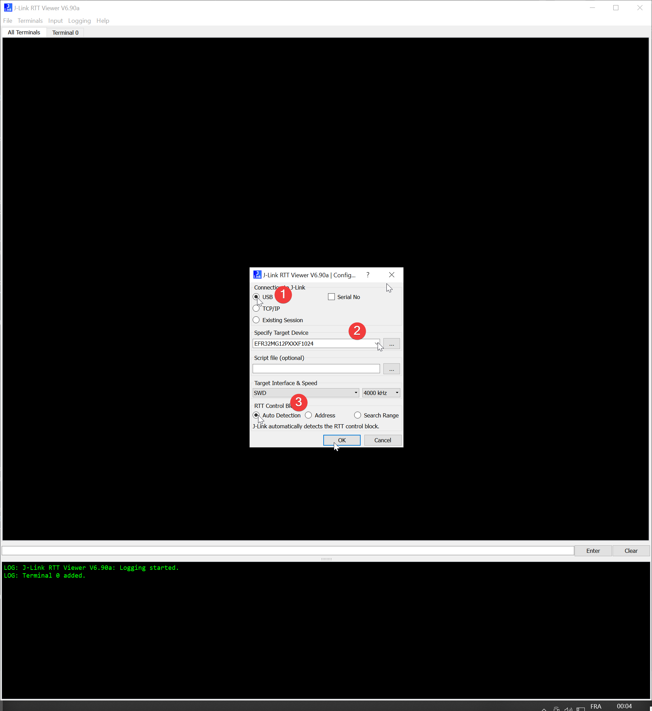
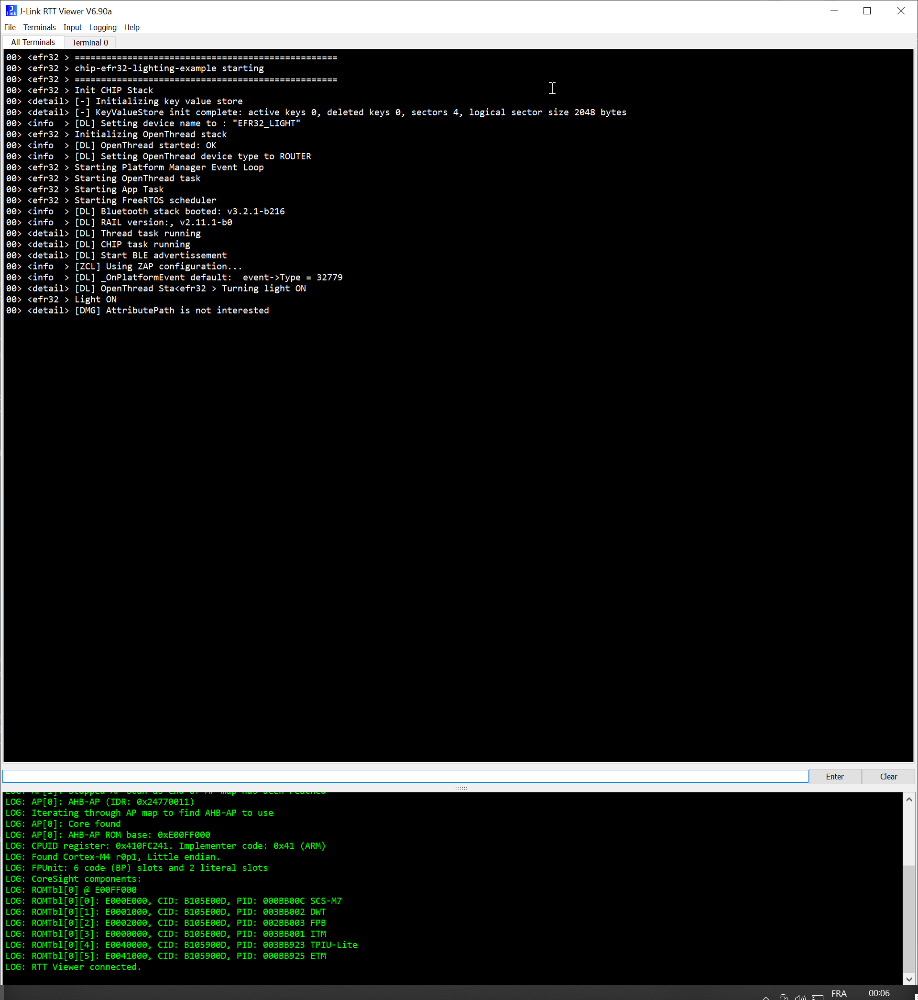

# Commissioning and Driving the Lighting App

Before continuing, ensure that you did build the Python Cotroller following this guide's prerequisites

## Debug device using RTT Viewer

Connect an RTT Viewer on the Thunderbaord Sense that is flashed with the Lighting App example

Depending on your Operating System, you will either use the GUI or commandline. Either way you need to have the JLIink Software Suite as in the preriquisites of the [Matter Development Setup guide]({{ site.github.url }}/OpenThread/Applications/Matter_development_setup/)

  * Using the shell bin **(For all users except WSL)**

    Log output can be viewed using the JLinkExe tool in combination with JLinkRTTClient as follows:

    1.  Run the JLinkExe tool with arguments to autoconnect to the WSTK board:

        ```bash    
        JLinkExe -device EFR32MG12P432F1024GL125 -speed 4000 -if SWD -autoconnect 1
        ```

    2.  In a second terminal, run the JLinkRTTClient to view logs:

        ```bash
        JLinkRTTClient
        ```

        **For the user conting via `ssh`, simply open a second ssh terminal to execute RTTClient**

  * Using the GUI **(Most likely for Windoes users)**

    Connect to your plugged Thunderboard :

    

    A successful connection should lead to :

    


## Commissioning and test

There are currently two tools used to commission and send ZCL commands to a Matter device:

1. [Chip-tool (recommended)](../CHIP_use_chip_tool)
2. [Python controller](../CHIP_use_python_controller)
