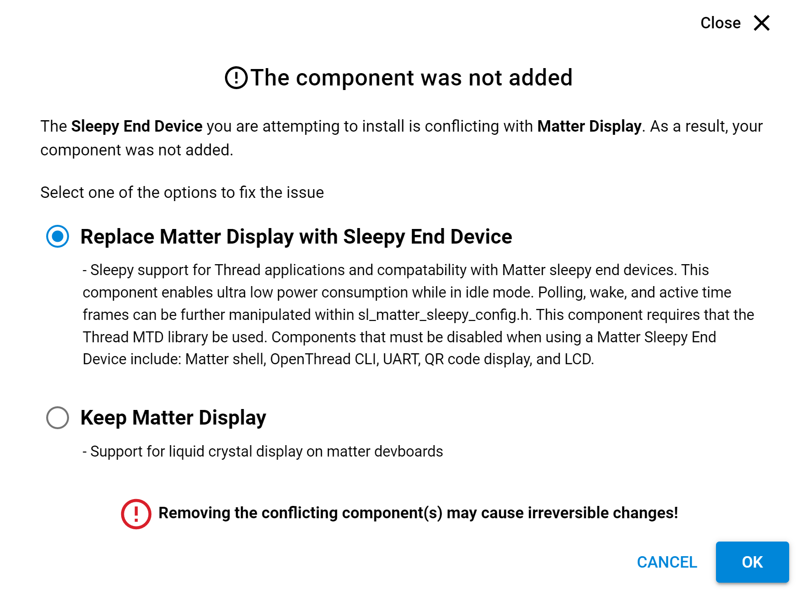

# SDK modification

Matter can be used either from
* SimplicityStudio
* [Matter official reporsitory](https://github.com/project-chip/connectedhomeip)
* [Silabs Matter reporsitory](https://github.com/SiliconLabs/matter) 

When using github repositories, follow [this guide]({{ site.github.url }}/OpenThread/Applications/Matter_development_setup/deploy_matter_env.html) to setup up a **Matter development environment** 

In this tutorial, we will only focus on the SimplicityStudio window covering example

1.  Once you have created a **MatterWindowCoverOverThread** project in Simplicity Studio, modify the **src/WindowAppImpl.cpp** file
  
    This modification allows to reach better consumption figures in both SED and SSED mode.
    By default, application event queue is polled every 10 ms. To reduce consumption, change the queue management from polling to blocking:

    ```bash
    -    BaseType_t received = xQueueReceive(mQueue, &event, pdMS_TO_TICKS(10));
    +    BaseType_t received = xQueueReceive(mQueue, &event, portMAX_DELAY);
    ```
2.  Add the **Sleepy End Device** component in your project. For all the conflicts raised, replace the current component by the Sleepy End device version.

 
 
3.  Modify the **InitOpenThread()** function of **matter_x.x.x/examples/platform/silabs/efr32/matter_config.cpp** file

    This modification will enable Synchronized Sleepy End Device type at Thread level.

    ```bash
   #if CHIP_DEVICE_CONFIG_THREAD_FTD
     ReturnErrorOnFailure(ConnectivityMgr().SetThreadDeviceType(ConnectivityManager::kThreadDeviceType_Router));
   #else // CHIP_DEVICE_CONFIG_THREAD_FTD
   #if CHIP_DEVICE_CONFIG_ENABLE_SED
   #if CHIP_DEVICE_CONFIG_THREAD_SSED
     ReturnErrorOnFailure(ConnectivityMgr().SetThreadDeviceType(ConnectivityManager::kThreadDeviceType_SynchronizedSleepyEndDevice));
   #else
     ReturnErrorOnFailure(ConnectivityMgr().SetThreadDeviceType(ConnectivityManager::kThreadDeviceType_SleepyEndDevice));
   #endif
   #else  // CHIP_DEVICE_CONFIG_ENABLE_SED
     ReturnErrorOnFailure(ConnectivityMgr().SetThreadDeviceType(ConnectivityManager::kThreadDeviceType_MinimalEndDevice));
   #endif // CHIP_DEVICE_CONFIG_ENABLE_SED
   #endif // CHIP_DEVICE_CONFIG_THREAD_FTD
    ```
4.  Add the definition of **CHIP_DEVICE_CONFIG_THREAD_SSED** macro to your project

