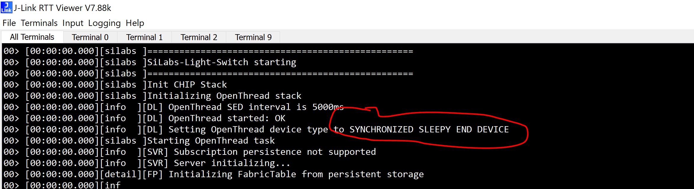
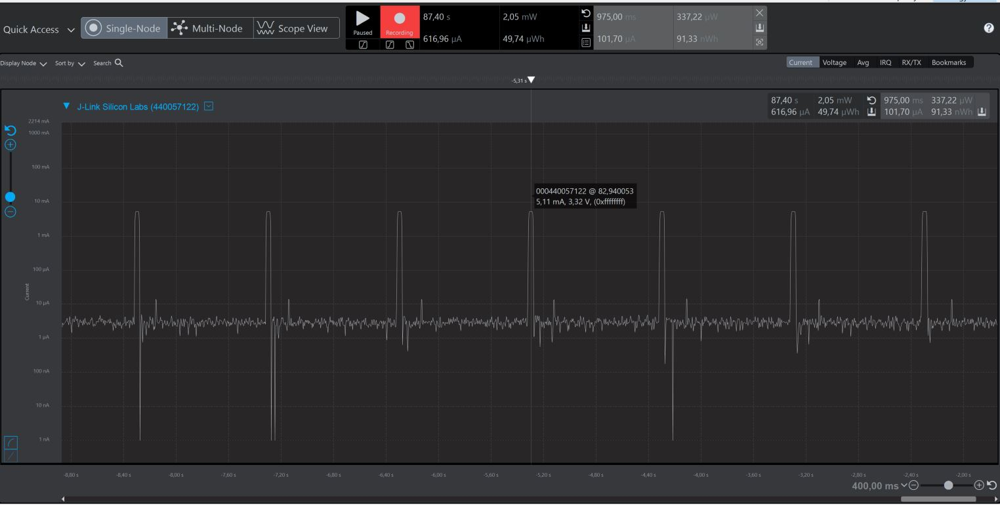

# Compilation

Once the modifications to SDK have been done, compilation can be lauched

# Testing

A **Openthread Border Router** running Thread 1.2 or greater and **Chip Tool** are necessary for testing.

Follow [this guide]({{ site.github.url }}/OpenThread/Applications/OpenThread_Border_Router) to prepare a Border router

Follow [this guide]({{ site.github.url }}/OpenThread/Applications/CHIP_use_chip_tool) to build and use Chip Tool

At startup, you should see the following message in RTT log meaning that your device is a Synchronized Sleepy End device

Once commissionned, you should see the following power consumtion curve. RX windows interval is configured in **Sleepy End Device** component with the **OpenThread Idle Interval** option 

