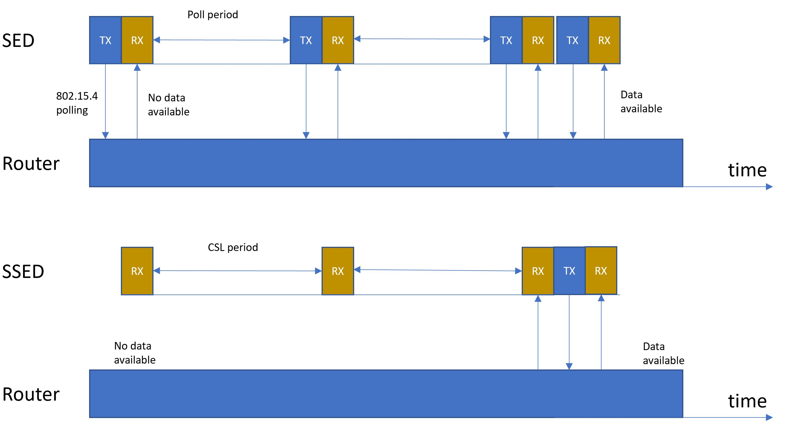

# What is Matter Synchronized Sleepy End Device

Matter Synchronized Sleepy End Device are devices that take advantage of the Thread 1.2 
optional enhancement to SEDs, known as Synchronized Sleepy End Devices (SSEDs). 
SSEDs are highly responsive, low power end devices that can maintain
a good quality of service in large, high density networks. This enables new use cases,
such as a scalable network of low-latency, battery powered actuators in the commercial
market.

SSEDs achieve this by using the Coordinated Sampled Listening (CSL) feature of IEEE
802.15.4-2015, maintaining synchronization with their parents and scheduling time to
have their receivers enabled. The parent is responsible for buffering messages for the
SSED until the SSED’s receiver is enabled.

This enables low power end devices that have low link latency, as they can remain asleep
for most of the time, but still wake up frequently for short periods in order to receive
messages. Unlike a non-synchronized SED that must wake up regularly and transmit a
MAC Data Request, SSEDs can simply wake up and listen for a short duration to
determine if there are any buffered messages.

By reducing the number of over air messages that are required, more end devices can
co-exist in the same space, as there is a lower chance of message collision. Continued
synchronization for the link can occur on the back of normal application data exchange.
By removing the requirement for regular MAC Data Request transmissions, battery life is
also improved.

SSEDs are particularly optimal for low power devices that primarily expect to receive with
low latency, such as actuators. Actuators can take advantage of their regular receptions
to keep the link synchronized and can listen with a frequency and duty cycle according to
the application requirements. Large numbers of these low-latency actuators can exist in
the same network without flooding it with MAC Data Requests.

OpenThread SDK [2.3.1.0 or higher](https://www.silabs.com/documents/public/release-notes/open-thread-release-notes-2.3.1.0.pdf)  must be used to support SSED.

 

