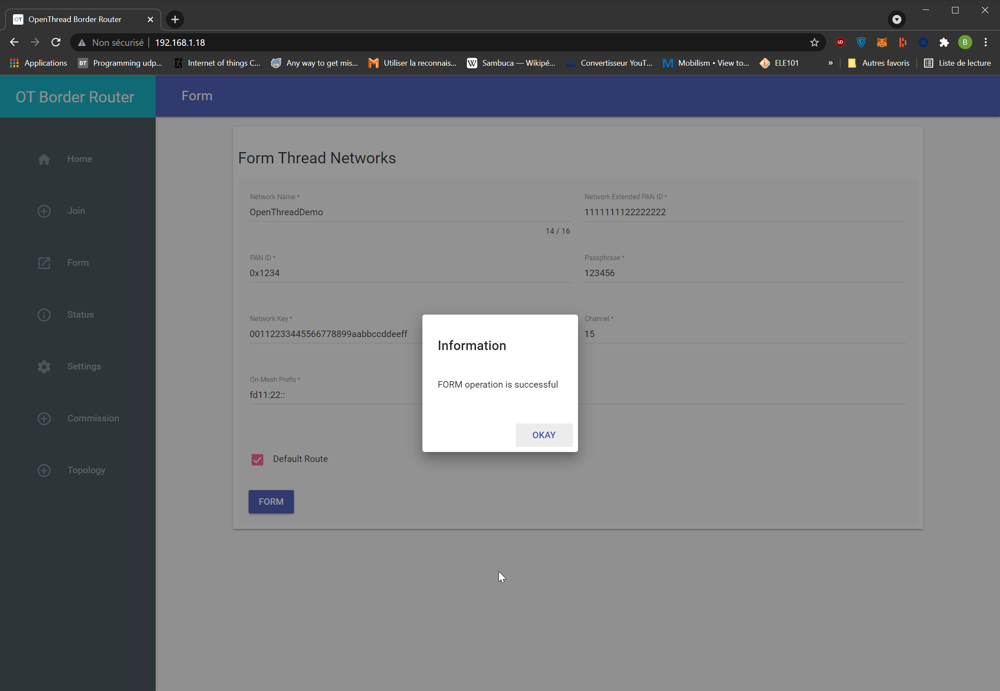
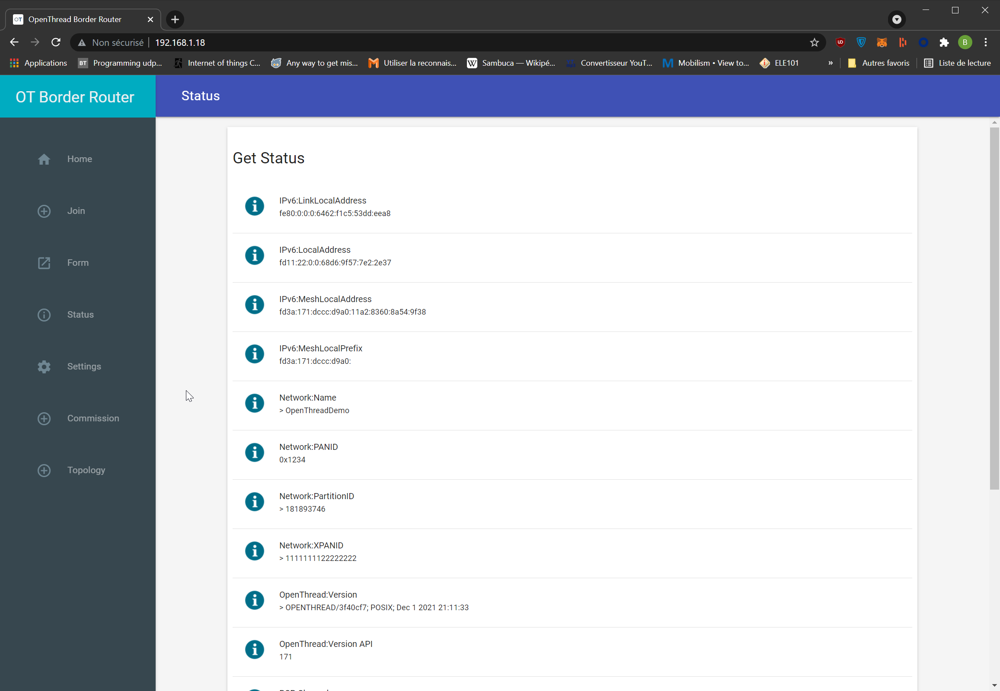

# Create an OpenThread Network

At this point the only remaining step is to create a thread Network

There are two ways of creating it, either through the OpenThread GUI interface or via ot-ctl

## Creating Network using the Web User interface

Use a webbrowser from a device **on the same ethernet network** as your Raspberry pi

1.  Browse for the ip address of your raspberry pi : `http://192.168.1.18`

2.  Go to the 'Form' section of the web page

    

3.  Click Form 

    A message should pop up to let you know about the operation success

    

4.  Check your OpenThread network status by going to the `Status` section of the web ui

    

These steps are well covered in the [official Border Router Guide](https://openthread.io/guides/border-router/web-gui)

## Creating Network using ot-ctl 
Run the following command to enter ot-ctl prompt :
```bash
sudo ot-ctl
> 
```

Then `factoryreset`. This one will need a double enter press to apply and bring back prompt
```bash
> factoryreset

>
```

Finally type the remaining ones :
```bash
> prefix add fd11:22::/64 paros
Done
> thread stop
Done
> ifconfig down
Done
> ifconfig up
Done
> thread start
Done
> state
leader
Done
> exit
```

The fact that you have a leader proves your network is up

You can also check the status of your network on the web ui

**IMPORTANT NOTE:** These commands won't retain your network configuration

To have a non volatile network configuration follow this [Manual Setup Guide](https://openthread.io/guides/border-router/external-commissioning/prepare#manual) or use the Web GUI 

