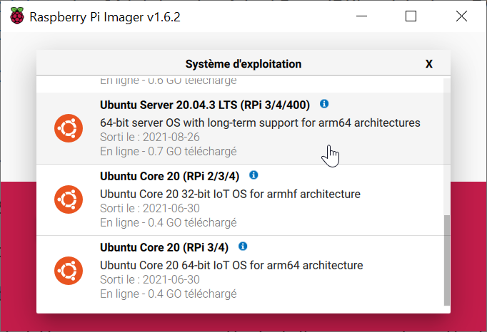
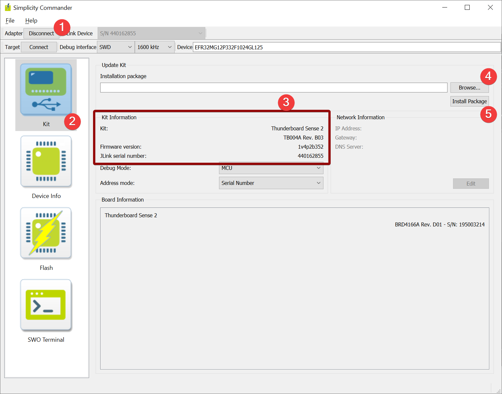
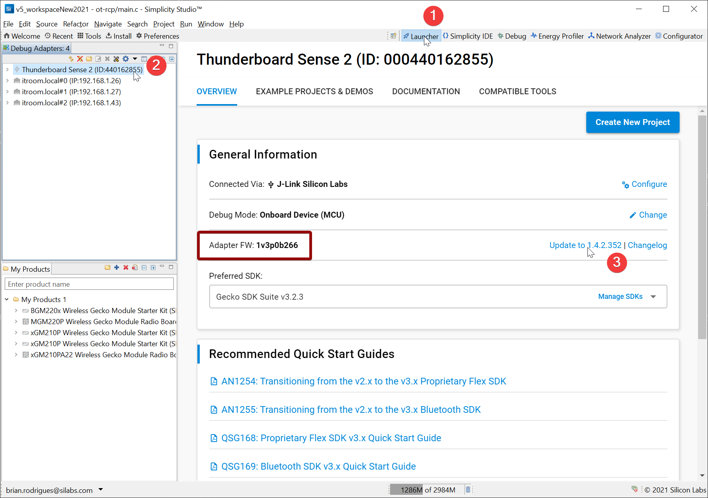

# Prerequisites

## What you need

  1.  A Linux based machine **that has a Bluetooth HCI interface**
  
      In this tutorial we are going to use a Raspberry Pi 4 running **Ubuntu 20.04 for Raspberry**

      **IMPORTANT NOTE : It is actually MANDATORY to use Ubuntu Server 64bits 20.04 LTS3 (arm64) if implementing Matter support on Raspberry Pi** 

      Any other distro, including Raspbian **will not allow you to build required Matter tools**
      
      Still this could be achieved on any other Ubuntu 20.04 system that has a BLE interface

  2.  Enable ssh on your Raspberry Pi (Optional, only if you do not use the RPi's HDMI interface)
     
      You can find a nice guide on how to achieve this according to your RPi usage on this [PhoenixNAP Knowledge Base Article](https://phoenixnap.com/kb/enable-ssh-raspberry-pi)

      You will also need an SSH client if you are connecting remotely to the Raspberry Pi or Build computer :
      * [PuTTY](https://www.putty.org/)
      * A good old Linux terminal (For Windows users, WSL can achieve this)
  
  3.  A Silicon Labs Wireless Starter Kit which can support Thread developement

      Full list is available on this [page](https://www.silabs.com/wireless/thread#software)
     
      Preferred and most economic option being our [Thunderboard Sense 2](https://www.silabs.com/development-tools/thunderboard/thunderboard-sense-two-kit)
  
  4.  `git` installed on your build machine

      For above mentionned systems a simple package manager installation should work 
      ```c
      sudo apt install git
      ```

  5.  A Jlink Flash Utility installed on your machine 
     
      This guide will use the JLink Package for Linux
     
      But other options such as Simplicity Commander or Simplicity Studio Flash Programmer would also work
     

**Note :**

This guide does not cover how to get a Raspberry pi up and running.
For that please refer to [this guide](https://projects.raspberrypi.org/en/projects/raspberry-pi-getting-started)

This guide does not cover how to perform a Linux installation on a computer.
For this please refer to [this guide](https://ubuntu.com/core/docs/getting-started)

## Getting started

  
  1.  Flash  your raspberry pi SD Card using [Raspberry Pi Imager](https://www.raspberrypi.com/software/) **(For Raspberry Pi users only)**

      Remeber, do not flash the regular Raspberry Pi OS but **Ubuntu Server 64bits 20.04 LTS3 (arm64)** image
      
      
      
      
      
      

      **Default login and password are :** ubuntu ubuntu
      
      You will be asked to change it upon first login

  2.  Get the IP address of your Raspberry Pi **(For SSH users only)**
      
      There are a few options here :
      * Use your router's management interface 

      * You can use a network discovery tool such as [Angry IP Scanner](https://angryip.org/download/#windows) (Win, Mac, Linux)
        
        A portable (no install required) executable is provided for Windows users
        
        Just scan your subnet for open ssh ports if you do not have a lot of devices supporting it (port 22)

  3.  Open a terminal on your Raspberry Pi (either local or via ssh from one of the above mentioned options) :

      For example using Linux/WSL ssh terminal command :
      ```bash
      ssh ubuntu@192.168.1.18
      ```

  4.  cd to your home directory if not already there :
      ```bash
      cd ~/
      ```

  5.  Create a dedicated folder within your /home/<user> directory for this development purpose
      ```bash
      mkdir ~/border_router_dev
      cd ~/border_router_dev
      ```

  6.  Check that you have git installed
      ```bash
      sudo apt update
      sudo apt install git
      sudo apt update
      ```
     
      If some packages can be upgraded feel free to do so, **but ensure to run an apt update as last command**

  7.  Make sure you have JLink Utilities installed
     
      Go to [JLink Download Page](https://www.segger.com/downloads/jlink/)
      Look for the package that suits your platform and Download it 
     
      For ease of use in a command line environment, we hosted a few packages on a Dropbox:
      * [JLink Linux ARM 32bits](https://www.dropbox.com/s/af7fy8yohhrnbbh/JLink_Linux_V758c_arm.deb)
      * [JLink Linux ARM 64bits](https://www.dropbox.com/s/yq7ncfc5y20b3hw/JLink_Linux_V758c_arm64.deb)
      * [JLink Linux amd64](https://www.dropbox.com/s/leolh6222ms31r0/JLink_Linux_V758c_x86_64.deb)

      For a raspberry pi setup running Ubuntu OS 64bit, downloaod as follows:
    
      ```bash
      wget https://www.dropbox.com/s/yq7ncfc5y20b3hw/JLink_Linux_V758c_arm64.deb
      ```

      Then install using :
      ```bash
      sudo apt update
      sudo apt install ./JLink_Linux_V758c_arm64.deb
      sudo apt update
      ```

  8.  Plug in your Thunderboard Sense 2 to your Raspberry Pi and check it is enumerated
     
      ```bash
      ls -ail /dev/ttyACM* 
      450 crw-rw-rw- 1 root dialout 166, 0 Nov 29 19:14 /dev/ttyACM0
      ```

  9.  Check that you can erase the Thunderboard Sense 2 using JLinkExe utility
      * First launch the `JLinkExe` utility using `JLinkExe -device EFR32MG12P432F1024GL125 -speed 4000 -if SWD -autoconnect 1`:

        ```bash
        JLinkExe -device EFR32MG12P432F1024GL125 -speed 4000 -if SWD -autoconnect 1

        SEGGER J-Link Commander V7.58c (Compiled Nov 24 2021 17:29:09)
        DLL version V7.58c, compiled Nov 24 2021 17:28:52

        Connecting to J-Link via USB...O.K.
        Firmware: Silicon Labs J-Link OB compiled Oct  3 2017 10:31:49
        Hardware version: V1.00
        S/N: 440162855
        License(s): RDI, FlashBP
        VTref=3.233V
        Device "EFR32MG12PXXXF1024" selected.


        Connecting to target via SWD
        InitTarget() start
        InitTarget() end
        Found SW-DP with ID 0x2BA01477
        DPv0 detected
        CoreSight SoC-400 or earlier
        Scanning AP map to find all available APs
        AP[1]: Stopped AP scan as end of AP map has been reached
        AP[0]: AHB-AP (IDR: 0x24770011)
        Iterating through AP map to find AHB-AP to use
        AP[0]: Core found
        AP[0]: AHB-AP ROM base: 0xE00FF000
        CPUID register: 0x410FC241. Implementer code: 0x41 (ARM)
        Found Cortex-M4 r0p1, Little endian.
        FPUnit: 6 code (BP) slots and 2 literal slots
        CoreSight components:
        ROMTbl[0] @ E00FF000
        [0][0]: E000E000 CID B105E00D PID 000BB00C SCS-M7
        [0][1]: E0001000 CID B105E00D PID 003BB002 DWT
        [0][2]: E0002000 CID B105E00D PID 002BB003 FPB
        [0][3]: E0000000 CID B105E00D PID 003BB001 ITM
        [0][4]: E0040000 CID B105900D PID 003BB923 TPIU-Lite
        [0][5]: E0041000 CID B105900D PID 000BB925 ETM
        Cortex-M4 identified.
        J-Link>

        ```
        This will open a prompt in which you can issue flash commands to the device

      * Then simply type `erase`
        ```bash
        J-Link>erase
        Without any given address range, Erase Chip will be executed
        Erasing device...
        Unable to load library icui18n "Cannot load library icui18n: (icui18n: cannot open shared object file: No such file or directory)"
        JLinkGUIServerExe: cannot connect to X server
        J-Link: Flash download: Total time needed: 0.218s (Prepare: 0.156s, Compare: 0.000s, Erase: 0.053s, Program: 0.000s, Verify: 0.000s, Restore: 0.008s)
        J-Link: Flash download: Total time needed: 0.111s (Prepare: 0.075s, Compare: 0.000s, Erase: 0.027s, Program: 0.000s, Verify: 0.000s, Restore: 0.008s)
        J-Link: Flash download: Total time needed: 0.111s (Prepare: 0.075s, Compare: 0.000s, Erase: 0.027s, Program: 0.000s, Verify: 0.000s, Restore: 0.008s)
        J-Link: Flash download: Total time needed: 0.576s (Prepare: 0.075s, Compare: 0.000s, Erase: 0.489s, Program: 0.000s, Verify: 0.000s, Restore: 0.011s)
        Erasing done.
        J-Link>
        ```

      * Finally just leave the prompt by typing `q`
        ```bash
        J-Link>q
        pi@raspberrypi:~/border_router_dev
        ```

      A dedicated [KBA has been writen in our community](https://community.silabs.com/s/article/update-efr32-firmware-using-j-link-on-raspberry-pi-command-line-x?language=en_US) for alternative help using the JLinkExe utility

  10. Update your Thunderboard Sense 2 Kit firmware with one that disbales UART HW Flow control

      First verify your firmware version is later than **1v3p0**

      Otherwise you could face Border Router runtime errors such as RadioSpinelNoResponse
     
      To do so use one of the 2 options below
     
      **At the time of writing (11/29/2021) there are two ways to update your Starter Kit's firmware**
     
      Both **CANNOT be run on Raspberry Pi**, only on Windows, Mac and Linux x86_64 platforms
    
      * Using Simplicity Commander 
        Start by downloading the utility for your computer:
        [Installer for Linux](https://www.silabs.com/documents/public/software/SimplicityCommander-Linux.zip)
        [Installer for Windows](https://www.silabs.com/documents/public/software/SimplicityCommander-Windows.zip)
        [Installer for Mac](https://www.silabs.com/documents/public/software/SimplicityCommander-Mac.zip)

        Note that Commander is installed by Simplicity Studio in `<StudioInstallDir>\SimplicityStudio\v5\developer\adapter_packs\commander`
        
        Or install each package and dependencies according to their README

        Download the latest firmware image from [here](https://www.dropbox.com/s/rlik7d0ktvuqv8h/S1015C_adapter_firmware_package_1v4p2b352.emz)
        
        If already downloaded by Simplicity Studio, it can also be found in : `<StudioInstallDir>\SimplicityStudio\v5\offline\hwtools\firmware\S1015C_adapter_firmware_package`
        Within linux use `wget` :
        ```bash
        wget https://www.dropbox.com/s/rlik7d0ktvuqv8h/S1015C_adapter_firmware_package_1v4p2b352.emz
        ```

        Commander can be used either by command line or GUI, the easiest being the GUI
        
        GUI Verify and Install :

        

        Command line Verify and Install :
        
        The command documented in [UG162 Chapter 6.8.1](https://www.silabs.com/documents/public/user-guides/ug162-simplicity-commander-reference-guide.pdf) is
        
        `$ commander adapter fwupgrade --serialno <J-Link serial number> <filename>`

        
        To find your JLink serial number you can use JLinkExe :
        ```bash
        JLinkExe
        SEGGER J-Link Commander V7.58c (Compiled Nov 24 2021 17:29:09)
        DLL version V7.58c, compiled Nov 24 2021 17:28:52

        Connecting to J-Link via USB...O.K.
        Firmware: Silicon Labs J-Link OB compiled Jun  6 2019 18:14:01
        Hardware version: V1.00
        S/N: 440162855
        License(s): RDI, FlashBP
        VTref=3.223V

        Type "connect" to establish a target connection, '?' for help
        J-Link>q
        ```

        In our case :
        `$ commander adapter fwupgrade --serialno 440162855 S1015C_adapter_firmware_package_1v4p2b352.emz`

        **Note : As mentioned above, this does not apply to Raspberry Pi OS**

      * Using Simplicity Studio
        Plug in your Thunderboard to the computer
      
        And open Simplicity's Launcher Perspective :
      
        
  
  11. Redo 8. and 9. to ensure you still have your Thunderboard Sense 2 connected and writeable

## Troubleshoot
If you precisely follow all of the previous steps, you should have a ready to use Linux envirnment

Still, if you run into some of these issues:

* **apt** operations fails because of `E: Could not get lock /var/lib/dpkg/lock`
  
  Follow method 2 of [this knowledge article](https://itsfoss.com/could-not-get-lock-error/)

* **ssh** login fails due to existing known_host

  This is due to the fact that you already had connected using ssh to the host but might have flashed a new linux distro on it

  As per `ssh`shell feedback, use `ssh-keygen -f "/home/brian/.ssh/known_hosts" -R "<your_target_ip>"`

