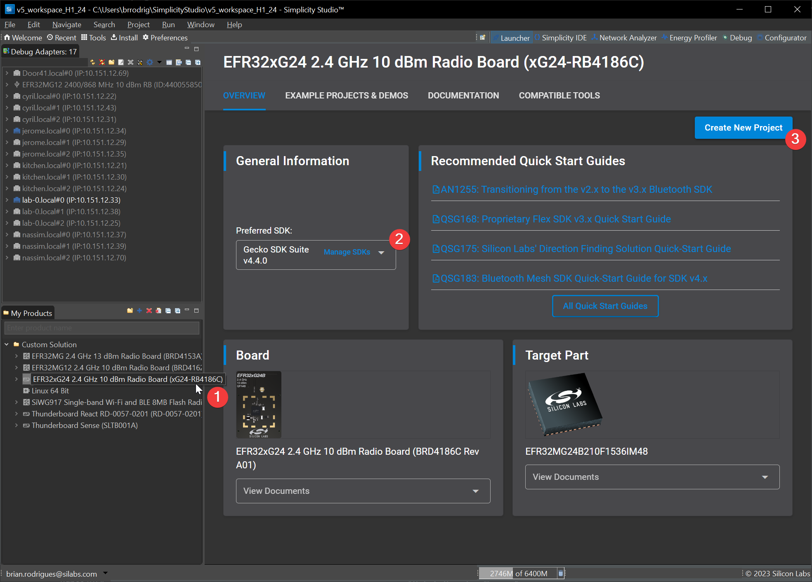

# NCP RCP firmware (CMP over UART)

Silicon Labs provides 2 types of CMP architectures :

* Dual RCP - Both Zigbee and OpenThread stacks reside in the Host CPU (RPi)
* Zigbee NCP + OpenThread RCP - Only OpenThread resides in the HOST CPU

This CMP architecture requires to create a project within Simplicity Studio on a dedicated radio board

Several OPNs can support this architecture, in this guide we will be using EFR32MG24 on a BRD4186C radio board.

It is up to the developper to adapt the below steps for his specific hardware / radio board

Finally, GSDK used to create this firmware must match the GSDK used previously to build host software

## Creating, Building and Flashing a Bootloader to the MCU

In order to get our RCP firmware to boot, we will need to flash a bootloader on it

Such bootloader can be built using Simplicity Studio : see [UG266](https://www.silabs.com/documents/public/user-guides/ug266-gecko-bootloader-user-guide.pdf)

Steps are as below :

1. Just as we did for the Z3GatewayCpc, we will use Simplicity Studio Launcher to list and create a BRD4186 project :

    

2. In the examples list, select `Bootloader - NCP UART XMODEM`

    This is an arbitrary choice, other bootloaders can be used. However we usually go with XMODEM for NCP applications

3. On the last step, adapt options as per your preferences and click finish

4. Simply build the project as is and flash it to the device using Simplicity Flash Programmer

## Creating, Building and Flashing an NCP / RCP CMP firmware to the MCU

Steps are similar to the bootloader, however we will not use the same example app :

1. Just as we did for the bootloader, we will use Simplicity Studio Launcher to list and create a BRD4186 project :

    

2. In the examples list, select `Zigbee - NCP + OpenThread - RCP zigbee_ncp-ot_rcp-uart`

3. On the last step, adapt options as per your preferences and click finish

4. Simply build the project as is and flash it to the device using Simplicity Flash Programmer

**Note 1:** If you disabled CPC encryption while configuring your cpc daemon, also disable this using the `CPC SECURITY` component from the `.slcp` file

**Note 2:** Do not erase memory before flash, doing so will erase the bootloader section. Redo bootloader flash if necessary (cf above)

At this point you can plug your development kit into your raspberry pi via USB

Other options are available (i.e. using a USB-UART bridge or directly wiring Expansion headers)