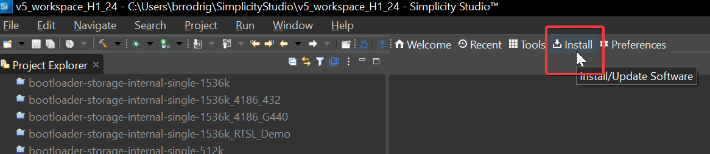
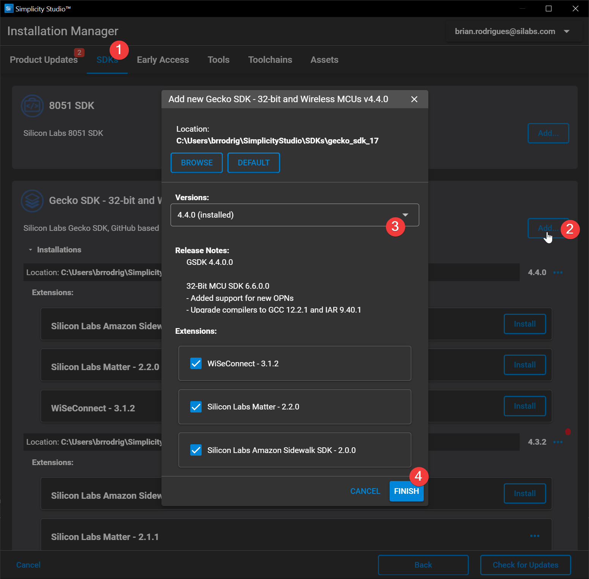
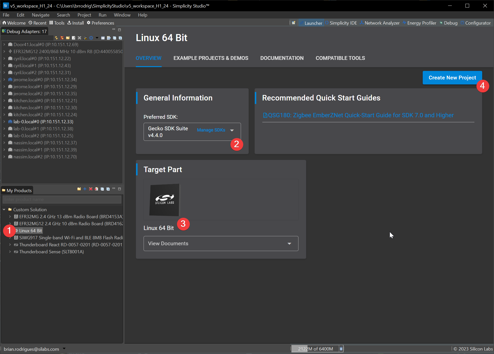

# Building Host Programs

Because we would like to have both Zigbee and Openthread capabilities, we will need to build 2 different host services :

* OTBR Agent
* Z3 Gateway CPC

However, to ensure interoperability, we need to align all different software versions.

Because CPC daemon is at the center of this architecture, we will align all our sw pieces around it.

CPCd version numbering aligns with Silicon Labs Gecko SDK version. OTBR sources used in this guide will come from GSDK

Eventually, since we are interested in running Matter, we will need to align version numbering with it too

## Identifying Matter/OpenThread related software commit hashes

* Start from CPC, which latest version is available on its [release page](https://github.com/SiliconLabs/cpc-daemon/releases/tag/v4.4.0)
  * In this case we are running `v4.4.0`
  * This can also be retrived on an deployed environment using `cpcd -v`

* From there we need to look at the [GSDK release page](https://github.com/SiliconLabs/gecko_sdk/releases) that matches v4.4.0 and look for the [OpenThread Release note](https://www.silabs.com/documents/public/release-notes/open-thread-release-notes-2.4.0.0.pdf) of that release
  * Section 8.2 provides : OpenThread GitHub repo (https://github.com/openthread/openthread)
    up to and including commit `7074a43e4`
  * Section 8.3 provides : OpenThread border router GitHub repo
    (https://github.com/openthread/ot-br-posix) up to and including commit `42f98b27b`

* Finally, if we want to use Matter over this router, we need to go to Silicon Labs' `matter_extension` repository [release page](https://github.com/SiliconLabs/matter_extension/releases) and look for the one that uses the same `v4.4.0` as we are, this appears to be [Matter Extension v2.2.0](https://github.com/SiliconLabs/matter_extension/releases/tag/v2.2.0)-1.2

  * Version listing provides : Gecko SDK `v4.4.0`
  * Version listing provides : OpenThread: `v2.4.0.0` | hash [7074a43e4](https://github.com/openthread/openthread/tree/7074a43e4)
  * Version listing provides : Matter hash `d140d5c8775`

At this point we are sure that Gecko SDK and OpenThread versions and hashes align . We also know which Matter and OTBR hash we will be using

In summary for developments with RCP from Simplicity Studio on GSDK 4.4.0 will require following hashes :

### CPC Daemon (CPCd)

| Repo                                      | Branch | Tag    | Commit Hash                              |
| ----------------------------------------- | ------ | ------ | ---------------------------------------- |
| https://github.com/SiliconLabs/cpc-daemon | main   | v4.4.0 | 1fcaa81347466165f81e4533ee4471e9c3b6db0a |

### Gecko SDK Suite (GSDK)

| Repo                                     | Branch   | Tag    | Commit Hash                              |
| ---------------------------------------- | -------- | ------ | ---------------------------------------- |
| https://github.com/SiliconLabs/gecko_sdk | gsdk_4.4 | v4.4.0 | 124fa19de8c8b3961d21c20857f7df32239786da |

If chiptool build is required :

### Connectivity Standards Alliance (CSA) connectedhomeip (Matter)

| Repo                                            | Branch | Tag    | Commit Hash                              |
| ----------------------------------------------- | ------ | ------ | ---------------------------------------- |
| https://github.com/project-chip/connectedhomeip | master |        | d140d5c87751603278f2483523993ee81922e7be |


### Silicon Labs fork of Connectivity Standards Alliance (CSA) connectedhomeip (Matter) used in Simplicity Studio

This does not allow build of chip-tool (Use CSA main repo)
This does not allow builds **outside of Simplicity Studio**

| Repo                                            | Branch | Tag    | Commit Hash                              |
| ----------------------------------------------- | ------ | ------ | ---------------------------------------- |
| https://github.com/SiliconLabs/matter_extension | main   | v2.2.0 | 73910fc57180440b09722040b1c847d5030e156e |

If required, everything can be built from sources using below each repo hash (Not covered in this guide, where we cover only building from GSDK) :

### OpenThread for RCP build

| Repo                                     | Branch | Tag | Commit Hash                              |
| ---------------------------------------- | ------ | --- | ---------------------------------------- |
| https://github.com/openthread/openthread | main   |     | 7074a43e4577d32d5535d52e7940ed2ea7e3a528 |

### OpenThread Border Router (OTBR)

| Repo                                       | Branch | Tag    | Commit Hash                              |
| ------------------------------------------ | ------ | ------ | ---------------------------------------- |
| https://github.com/openthread/ot-br-posix  | main   | v4.4.0 | 42f98b27bc7f54951c860cd98ce5ff7c7fedc68c |

## Downloading and Building OTBR Agent

### Downloading OTBR sources

Since we are using CPC, we will fully rely on OTBR sources provided via Silicon Labs GSDK

We go back to our working directory :

```bash
cd ~/border_router_dev
```

And clone Gecko SDK version 4.4.0 :

```bash
git clone https://github.com/SiliconLabs/gecko_sdk.git
cd gecko_sdk
git checkout v4.4.0
```

### Building OTBR Agent

Building OTBR Agent requires a lot of extra steps from GSDK.

1. First we need to symlink the OpenThread repo from GSDK to the ot-br-posix third party repo :

   ```bash
   ln -s ~/border_router_dev/gecko_sdk/util/third_party/openthread/ ~/border_router_dev/gecko_sdk/util/third_party/ot-br-posix/third_party/openthread/repo 
   ```
2. Copy the Silicon Labs specific platform header to the ot-br-posix folder

   ```bash
   cp protocol/openthread/platform-abstraction/posix/openthread-core-silabs-posix-config.h util/third_party/openthread/src/posix/platform/
   ```
3. Set the GSDK absolute path as an environment variable

   ```bash
   export GSDK_DIR=~/border_router_dev/gecko_sdk
   ```
4. Set the CPCd source directory path as an environment variable

   ```bash
   export CPCD_DIR=~/border_router_dev/cpc-daemon
   ```

At this stage we are ready to launch the OTBR Agent build command with CPC support. For detailed documentation about the build options refer to section 2.2.3.2 of [AN1333](https://www.silabs.com/documents/public/application-notes/an1333-concurrent-protocols-with-802-15-4-rcp.pdf)

Go into the `ot-br-posix` folder :

```bash
cd ~/border_router_dev/gecko_sdk/util/third_party/ot-br-posix/
```

To launch the build procedure run :

```bash
sudo RELEASE=1 REFERENCE_DEVICE=1 BACKBONE_ROUTER=1 NAT64=1 DNS64=1 ./script/bootstrap
```

This will install all dependencies required to build the agent and can take a while

Followed by :

```bash
sudo INFRA_IF_NAME=eth0 RELEASE=1 REFERENCE_DEVICE=1 BACKBONE_ROUTER=1 BORDER_ROUTING=1 NAT64=1 DNS64=1 OTBR_OPTIONS="-DOT_THREAD_VERSION=1.3 -DOT_MULTIPAN_RCP=ON -DCPCD_SOURCE_DIR=$CPCD_DIR -DOT_POSIX_RCP_VENDOR_BUS=ON -DOT_POSIX_CONFIG_RCP_VENDOR_DEPS_PACKAGE=$GSDK_DIR/protocol/openthread/platform-abstraction/posix/posix_vendor_rcp.cmake -DOT_POSIX_CONFIG_RCP_VENDOR_INTERFACE=$GSDK_DIR/protocol/openthread/platform-abstraction/posix/cpc_interface.cpp -DOT_CONFIG=openthread-core-silabs-posix-config.h -DOTBR_DUA_ROUTING=ON -DOTBR_DNSSD_DISCOVERY_PROXY=ON -DOTBR_SRP_ADVERTISING_PROXY=ON" ./script/setup
```

***Be careful, AN1333 contains a lot of typos and errors if you use the command provided there***
***It is also not up to date as to the -DOT_POSIX_RCP_VENDOR_BUS=ON usage***

## Building Zigbee 3.0 CPC Host

### Generating Project using Simplicity Studio

Simplcity studio is required to generate the Zigbee Host software required to address the NCP CMP firmware. If you followed this guide in its entirety, you should already the have the IDE up and running

First step will be to Download the Gecko SDK that matches the versioning we chose above at CPCd stage. In our case we will fetch GSDK `v4.4.0`

To do so, simply click the `Install` button and click on `Manage Installed Packages` :



Once in the package manager, got to the `SDK` tab and click `Add SDK`



When done, go back the `Launcher` perspective of the IDE (Main Menu) and do precisely as follows :

1. Locate the `My Products` view and type `linux` in the textbox
2. Click `Linux 64 bit` and/or `Linux 32 bit` depending on the architecture you run your hosts
3. You should now have a `Linux 64 Bit` listed in the products view
4. Click `Linux 64 Bit` listed in the products view, this should rearrange the `Launcher` so you can create a project for Linux archs on GSDK 4.4.0
5. Click `Create New Project` in the main view

   
6. In the examples list, look for `Zigbee - Gateway CPC` and click `Next`
7. In the `With project files:` select `Copy contents` and then click `Finish`

   

At this point we have a default CPC Host project that we can either cross compile locally or push on our Gateway and build there.

We will go for the second option

***Note : If you do not follow these steps exactly as described, you might not be able to generate a project for Linux Hosts using the Wizard and/or build it later on***

### Copying the Zigbee Gateway sources to the Raspberry Pi

Linux/Mac users can simply use scp to copy the entire `Z3GatewayCpc` folder and its contents to our border router working directory

Windows users can use [WinSCP](https://winscp.net/eng/download.php)

Back on the Raspberry, cd to the Zigbee project folder we just copied:

```bash
cd ~/border_router_dev/Z3GatewayCpc/
```

### Building the Zigbee Gateway sources on the Raspberry Pi

Silicon Labs Host projects are Makefile based, simply call make by specifying the makefile provided in the project directory as below :

```bash
make -f Z3GatewayCpc.Makefile -j2
```

The resulting executable file will be located under `build/debug/Z3GatewayCpc`
