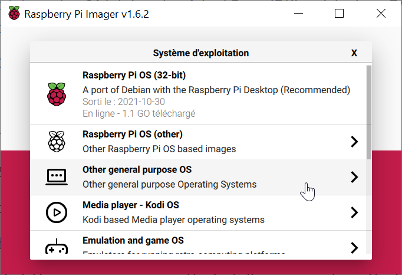
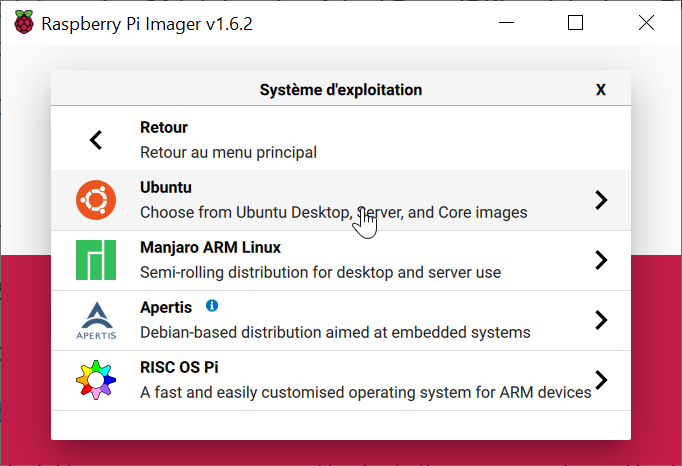
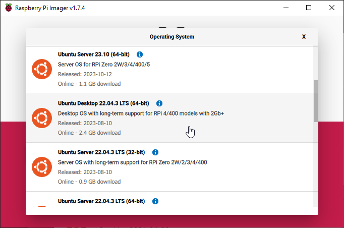

# Prerequisites

## What you need

1. A Linux based machine **that has a Bluetooth HCI interface**

   In this tutorial we are going to use a Raspberry Pi 4 running **Ubuntu 22.04.3 for Raspberry**

   **IMPORTANT NOTE : It is actually MANDATORY to use Ubuntu Server 64bits 22.04.3 LTS (arm64) if implementing Matter support on Raspberry Pi**

   Any other distro, including Raspbian **will not allow you to build required Matter tools**

   Still this could be achieved on any other Ubuntu 22.04 system that has a BLE interface
2. Enable ssh on your Raspberry Pi (Optional, only if you do not use the RPi's HDMI interface)

   You can find a nice guide on how to achieve this according to your RPi usage on this [PhoenixNAP Knowledge Base Article](https://phoenixnap.com/kb/enable-ssh-raspberry-pi)

   You will also need an SSH client if you are connecting remotely to the Raspberry Pi or Build computer :

   * [PuTTY](https://www.putty.org/)
   * A good old Linux terminal (For Windows users, WSL can achieve this)
3. A Silicon Labs Wireless Starter Kit which can support Thread developement

   Full list is available on this [page](https://www.silabs.com/wireless/thread#software)

   Preferred and most economic option being our [EFR32 MG24 Devkit](https://www.silabs.com/development-tools/wireless/efr32xg24-dev-kit?tab=overview)
4. `git` installed on your build machine

   For above mentionned systems a simple package manager installation should work

   ```bash
   sudo apt install git
   ```
5. Simplicity Studio to build a Zigbee NCP / OpenThread RCP image

   Simplicity Studio can be downloaded [here](https://www.silabs.com/developers/simplicity-studio)
6. A Flash Utility installed on your machine (either via Simplicity Studio or JLink)

   Simplicity comes with Simplicity Commander or Simplicity Studio Flash Programmer

   This guide will use Simplicity Commander

**Note :**

This guide does not cover how to get a Raspberry pi up and running.
For that please refer to [this guide](https://projects.raspberrypi.org/en/projects/raspberry-pi-getting-started)

This guide does not cover how to perform a Linux installation on a computer.
For this please refer to [this guide](https://ubuntu.com/core/docs/getting-started)

## Getting started

1. Flash  your raspberry pi SD Card using [Raspberry Pi Imager](https://www.raspberrypi.com/software/) **(For Raspberry Pi users only)**

   Remeber, do not flash the regular Raspberry Pi OS but **Ubuntu Server 64bits 22.04 LTS3 (arm64)** image

   

   

   

   **Default login and password are :** ubuntu ubuntu

   You will be asked to change it upon first login
2. Get the IP address of your Raspberry Pi **(For SSH users only)**

   There are a few options here :

   * Use your router's management interface
   * You can use a network discovery tool such as [Angry IP Scanner](https://angryip.org/download/#windows) (Win, Mac, Linux)

     A portable (no install required) executable is provided for Windows users

     Just scan your subnet for open ssh ports if you do not have a lot of devices supporting it (port 22)
3. Open a terminal on your Raspberry Pi (either local or via ssh from one of the above mentioned options) :

   For example using Linux/WSL ssh terminal command :

   ```bash
   ssh ubuntu@192.168.1.18
   ```
4. cd to your home directory if not already there :

   ```bash
   cd ~/
   ```
5. Create a dedicated folder within your /home/`<user>` directory for this development purpose

   ```bash
   mkdir ~/border_router_dev
   cd ~/border_router_dev
   ```
6. Check that you have git installed

   ```bash
   sudo apt update
   sudo apt install git
   sudo apt update
   ```
7. Plug in your Devkit to your Raspberry Pi and check it is enumerated

   ```bash
   ls -ail /dev/ttyACM* 
   450 crw-rw-rw- 1 root dialout 166, 0 Nov 29 19:14 /dev/ttyACM0
   ```

## GCC Alternatives

Using the Ubuntu 22.04.3 LTS image we end up using GCC v11. However, Silicon Labs is now recommending switching to GCC v12 for its software.

To get everything aligned, we will make GCC v12 available on the RPi using `update-alternatives` utility:

1. First, make sure you are not already using gcc 12 by issuing `gcc -v`
2. Then install gcc v12 by calling `sudo apt install gcc-12 g++-12`
3. Once both are available, we need to make use of the `update-alternatives` tool
   As explained [here](https://askubuntu.com/questions/26498/how-to-choose-the-default-gcc-and-g-version) :

   Symbolic links `cc` and `c++` are installed by default. We will install symbol links for `gcc` and `g++`, then link `cc` and `c++` to `gc`c and `g++` respectively. (Note that the `10`, `20` and `30` options are the priorities for each alternative, where a bigger number is a higher priority.)

   Install alternatives :

   ```bash
   sudo update-alternatives --install /usr/bin/gcc gcc /usr/bin/gcc-11 10
   sudo update-alternatives --install /usr/bin/gcc gcc /usr/bin/gcc-12 20

   sudo update-alternatives --install /usr/bin/g++ g++ /usr/bin/g++-11 10
   sudo update-alternatives --install /usr/bin/g++ g++ /usr/bin/g++-12 20

   sudo update-alternatives --install /usr/bin/cc cc /usr/bin/gcc 30
   sudo update-alternatives --set cc /usr/bin/gcc

   sudo update-alternatives --install /usr/bin/c++ c++ /usr/bin/g++ 30
   sudo update-alternatives --set c++ /usr/bin/g++
   ```

   By default, gcc and g++ v12 will be used, but if required, you can switch between each using :
   Configure alternatives :

   ```bash
   sudo update-alternatives --config gcc
   sudo update-alternatives --config g++
   ```

   Prompt will be as follows :

   ```bash
   There are 2 choices for the alternative gcc (providing /usr/bin/gcc).

     Selection    Path             Priority   Status
   ------------------------------------------------------------
   * 0            /usr/bin/gcc-12   20        auto mode
     1            /usr/bin/gcc-11   10        manual mode
     2            /usr/bin/gcc-12   20        manual mode

   Press <enter> to keep the current choice[*], or type selection number:
   ```

   Calling `gcc-v` should now show v12.x.x

## Troubleshoot

If you precisely follow all of the previous steps, you should have a ready to use Linux envirnment

Still, if you run into some of these issues:

* **apt** operations fails because of `E: Could not get lock /var/lib/dpkg/lock`

  Follow method 2 of [this knowledge article](https://itsfoss.com/could-not-get-lock-error/)
* **ssh** login fails due to existing known_host

  This is due to the fact that you already had connected using ssh to the host but might have flashed a new linux distro on it

  As per `ssh`shell feedback, use `ssh-keygen -f "/home/brian/.ssh/known_hosts" -R "<your_target_ip>"`
* ssh login fails because of "connection refused"
  make sure that you have installed ssh `sudo apt install openssh-server` and enabled it `sudo systemctl enable ssh` and `sudo systemctl start ssh`
