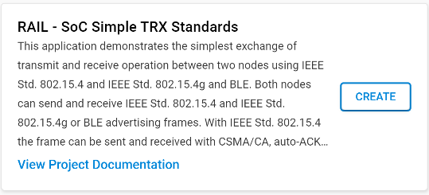
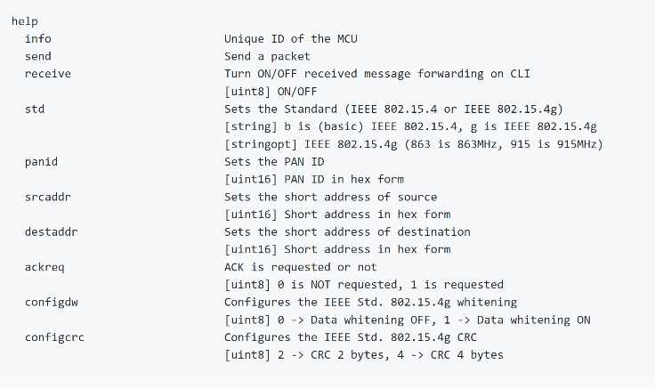

# Sending a Magic Packet

Use the `rail_soc_simple_trx_std` example to send magic packet. By default example send/receive 802.15.4 frame, so you don't need to modify frame format.

The addresses (Src and Dst) and the PAN ID can be customized via CLI commands. If you want a complete
list of the available commands issue the help command.

Once your packet has been customized, use the `send` command to send the packet and wake-up the RCP.

# Testing the wake-up functionality

If you are using a BRD4166A, follow this sequence to validate the behavior:

1.  Start the OTBR and create a Thread network. To do so, follow [this guide]({{ site.github.url }}/OpenThread/Applications/OpenThread_Border_Router/create_network.md)
2.  Retrieve PanId of the created Thread network.
3.  Press Button 0 on BRD4166. After, pressing button, RCP will be sensitive to the wake-up frame if it matches filter.
4.  You can now disconnect UART RX/TX from Host side. BRD4166 needs to stay powered. (You can use Mini Simplicity connector to do so)
5.  On Sender side, using CLI, set SrcAddr = 0xFFFF, DstAddr = 0xFFFF, and PanId to the PanId retrieved above using CLI
6.  Finally send a packet with the sender. Red led of BRD4166 should will switch on.

