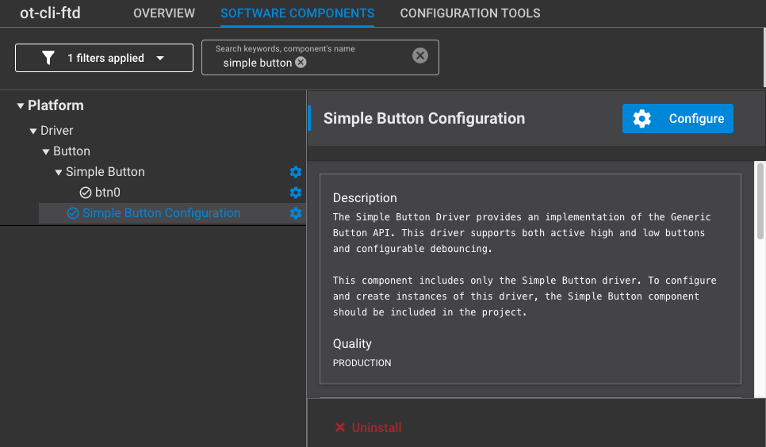
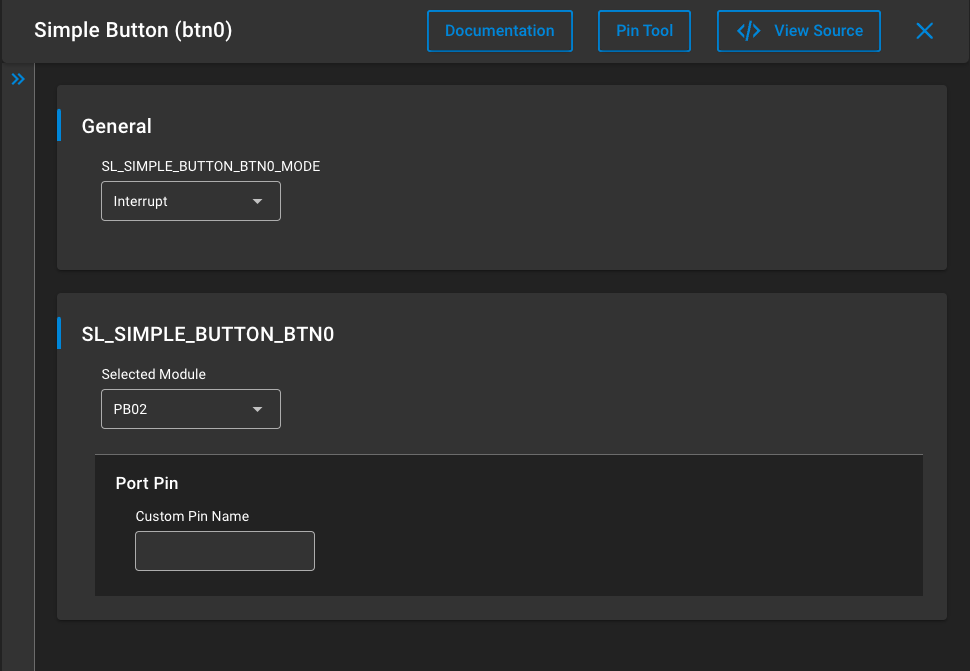

# Create a Coap command

In this section we will add a coap command to control the "gpio" resource of the other nodes.

We will add the button support and trigger the coap message transmission from a button press.

## 1. add Simple button component to your project

Open your project slcp file in Studio, then select software component and search for Simple button.

you should get the below view, then click on configure.



In the configuration view of the instance, change the GPIO if necessary. For a developper kit this is auto-populated



Now we can start using this button adding code in the project.

## 2. use the button to trigger a action

Adding BTN0 to the project enables app.c following headers:

```c
#if (defined(SL_CATALOG_BTN0_PRESENT) || defined(SL_CATALOG_BTN1_PRESENT))
#include "sl_button.h"
#include "sl_simple_button.h"
#endif
```

and function:

```c
#if (defined(SL_CATALOG_BTN0_PRESENT) || defined(SL_CATALOG_BTN1_PRESENT))
void sl_button_on_change(const sl_button_t *handle)
{
    if (sl_button_get_state(handle) == SL_SIMPLE_BUTTON_PRESSED)
    {
        sButtonPressed = true;
#ifdef SL_CATALOG_KERNEL_PRESENT
        sl_ot_rtos_set_pending_event(SL_OT_RTOS_EVENT_APP);
#endif
        otSysEventSignalPending();
    }
}
#endif

```

now we need to take advantage of sButtonPressed from above function in the app_process_action() like shown below :

```c
/******************************************************************************
 * Application Process Action.
 *****************************************************************************/
void app_process_action(void)
{

    otTaskletsProcess(sInstance);
    otSysProcessDrivers(sInstance);
    if (!server_started)
      {
        if (otThreadGetDeviceRole(sInstance) > OT_DEVICE_ROLE_DETACHED) {
            // Thread network is active
            coap_server_init(sInstance);
            server_started = true;
        } else {
            // Thread network is not active
        }
      }
    // action on button press
    if (sButtonPressed)
        {
            sButtonPressed = false;
            send_command();
        }
}

```

because we added a call to send_command()  we need to add its decalration to the file :

```c
extern void send_command(void);

```

## 3. Coap command send function

We move back to our coap_example.c file.

we define the mesh multicast address so that our command is received by all the nodes in the OpenThread PAN:

```c
// Define the multicast address (example: all nodes in the network)
const char *multicastAddress = "ff03::1";

```

And we add the function preparing the message with a TOGGLE on "gpio" resource for the multicast address:

```c
extern "C" void send_command(void)
{
  // Prepare the CoAP message
  otMessage *message = otCoapNewMessage(sInstance, NULL);
  otCoapMessageInit(message, OT_COAP_TYPE_NON_CONFIRMABLE, OT_COAP_CODE_PUT);
  otCoapMessageGenerateToken(message, OT_COAP_DEFAULT_TOKEN_LENGTH);
  otCoapMessageAppendUriPathOptions(message, UriPath);
  otCoapMessageSetPayloadMarker(message);

   // Add payload to the message
   const char *payload = "TOGGLE";
   otMessageAppend(message, payload, strlen(payload));

   // Prepare message info
   otMessageInfo messageInfo;
   memset(&messageInfo, 0, sizeof(messageInfo));
   otIp6AddressFromString(multicastAddress, &messageInfo.mPeerAddr);
   messageInfo.mPeerPort = OT_DEFAULT_COAP_PORT;

   // Send the CoAP message
   otError error = otCoapSendRequest(sInstance, message, &messageInfo, NULL, NULL);

   // some prints for understanding if the message was sent
   if (error != OT_ERROR_NONE) {
      otMessageFree(message);
      otCliOutputFormat("\nmessage send error %d\r", error);
      }
    else
      otCliOutputFormat("\nmessage sent\r");

}
```

## 4. compile, flash and test

Compile and flash the binary on 2 developper kits like on previous step when we created the resource.

The test the behavior, you will need to recreate the nework like describe in previously, then you can still use the cli but if you press BTN0 on one of the developper kits, the other(s) will see their LED toggle.

This demonstrates how to use coap in OpenThread.
