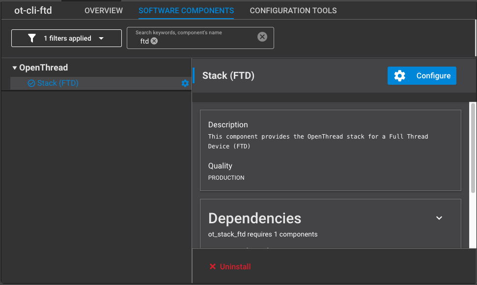
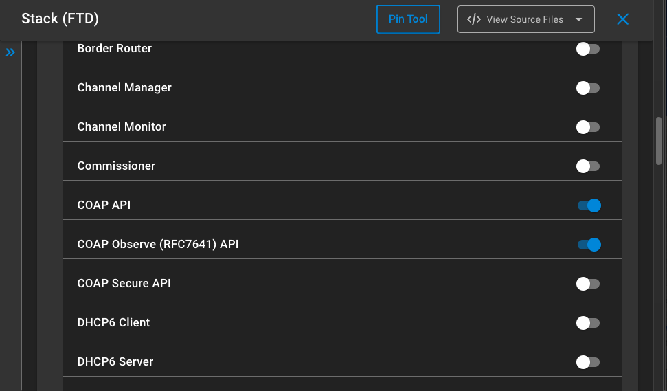

# Create a Coap resource

In this section we will first add Coap server support to the stack and then create a resource.

The resource of this example will be named "gpio" and will be used to control a LED using ON, OFF or TOGGLE commands.

To simplify testing, we will start from the ot-cli-ftd example available in Simplicity Studio v5.

Hardware used will be the [xG24-DK2601B ](https://www.silabs.com/development-tools/wireless/efr32xg24-dev-kit?tab=overview)(EFR32MG24 developper kit).

## 1. add coap support to your project

Open your project slcp file in Studio, then select software component and search for ftd.

you should get the below view, then click on configure.



In the configuration view, scroll down to the select COAP API and optionnaly COAP Observe if you wanted to get notified on resource change.



Now we can start using Coap inside the cli like described [here](https://openthread.io/reference/cli/concepts/coap?hl=fr), or by adding code.

## 2. cretate a resource

Server resource in coap is the structure through which communication happens.

in our case the resource will be named "gpio" and controlled using the PUT method with ON, OFF and TOGGLE commands. 

ON and OFF are also states you could read back with a GET method

### 2.1 create a new file for coap application

create a new c file in your project. I named it coap_example.c in my project.

add the necessary headers to the file:

```c
#include <stdio.h>
#include <string.h>
#include <openthread/coap.h>
#include <openthread/cli.h>

#include <openthread/logging.h>
#include "utils/code_utils.h"
#include "em_gpio.h"
#include "em_cmu.h"
```

now we need to add a function that will start the server and add the new resource:

```c
#define OFF 1
#define ON 0
static const char *UriPath = "gpio";
uint8_t gpioState[3] = "OFF";
otCoapResource coapResourcegpio;
static otInstance *sInstance = NULL;

extern "C" void coap_server_init(otInstance *aInstance)
{
  // saves OT instance
  sInstance = aInstance;

  // Enable GPIO clock and init Led GPIO
  CMU_ClockEnable(cmuClock_GPIO, true);
  GPIO_PinModeSet(gpioPortA, 4, gpioModePushPull, OFF);

  // Start Coap 
  otCoapStart(aInstance, OT_DEFAULT_COAP_PORT);

  // Populate the resource structure
  coapResourcegpio.mContext=aInstance;
  coapResourcegpio.mUriPath=UriPath;
  coapResourcegpio.mHandler=coap_request_handler;
  coapResourcegpio.mNext=NULL;

  // Create the resource
  otCoapAddResource(aInstance, &coapResourcegpio);

  // Some comment on the cli to understand the Coap server is ready
  otCliOutputFormat("\nCoAP server initialized\r\n");

}

```


now we need to create the handler pointed in the resource structure to respond to the coap message:

```c
void coap_request_handler(void *aContext, otMessage *aMessage, const otMessageInfo *aMessageInfo)
{
  otError error = OT_ERROR_NONE;
  otMessage *responseMessage;
  otCoapCode responseCode = OT_COAP_CODE_CHANGED;
  otCoapCode messageCode = otCoapMessageGetCode(aMessage);  // read code (get,put,post..)
  otCoapType messageType = otCoapMessageGetType(aMessage);  // read message type (confirmable or not)

  // read any payload
  char data[32];
  uint16_t offset = otMessageGetOffset(aMessage);
  uint16_t read = otMessageRead(aMessage, offset, data, sizeof(data) - 1);
  data[read] = '\0';

  // prepare any message or at leastacknowledge response if confirmation is required
  responseMessage = otCoapNewMessage((otInstance*)aContext, NULL);

  otCoapMessageInitResponse(responseMessage, aMessage, OT_COAP_TYPE_ACKNOWLEDGMENT, responseCode);
  otCoapMessageSetToken(responseMessage, otCoapMessageGetToken(aMessage), otCoapMessageGetTokenLength(aMessage));
  otCoapMessageSetPayloadMarker(responseMessage);

  // treat code action
  switch (messageCode) {

    case OT_COAP_CODE_GET:
      error = otMessageAppend(responseMessage, gpioState, strlen((const char*)gpioState));
      otEXPECT(OT_ERROR_NONE == error);
      error = otCoapSendResponse((otInstance*)aContext, responseMessage, aMessageInfo);
      otEXPECT(OT_ERROR_NONE == error);
      break;

    case OT_COAP_CODE_PUT:
    case OT_COAP_CODE_POST:

      // process message
      if(strcmp("ON", data) == 0)
        {
          // update the attribute state 
          memcpy(gpioState, "ON", sizeof(3));
          // set LED ON
          GPIO_PinOutClear(gpioPortA, 4);
        }
      else if(strcmp("OFF", data) == 0)
        {
          // update the attribute state
          memcpy(gpioState, "OFF", sizeof(3));
          // set LED OFF
          GPIO_PinOutSet(gpioPortA, 4);
        }
      else if(strcmp("TOGGLE", data) == 0)
              {
                // update the attribute state
                if (strcmp("ON", gpioState) == 0)
                  memcpy(gpioState, "OFF", sizeof(3));
                else
                  memcpy(gpioState, "ON", sizeof(3));
                // toggle LED 
                GPIO_PinOutToggle(gpioPortA, 4);
              }
      else
        {
          /* no valid body, fail without response */
          otEXPECT_ACTION(false, error = OT_ERROR_NO_BUFS);
        }

      if (OT_COAP_TYPE_CONFIRMABLE == messageType)
        {
          error = otMessageAppend(responseMessage, gpioState,strlen((const char*)gpioState));
          otEXPECT(OT_ERROR_NONE == error);
          error = otCoapSendResponse((otInstance*)aContext,responseMessage, aMessageInfo);
          otEXPECT(OT_ERROR_NONE == error);
        }
      break;

    default:
      // nothing to do...
      break;
  }

  exit:

    if (error != OT_ERROR_NONE && responseMessage != NULL)
      {
        otMessageFree(responseMessage);
      }


}

```


Finally we need to call the coap_server_init() function from the app.c. We should integrate this call as the stack is initialized and commissioned to a network.

This is the case as the Thread device role is greater than DETACHED. it is then either a LEADER, a ROUTER or a CHILD:

```c
extern void coap_server_init(otInstance *aInstance);

/******************************************************************************
 * Application Process Action.
 *****************************************************************************/
void app_process_action(void)
{

    otTaskletsProcess(sInstance);
    otSysProcessDrivers(sInstance);
    if (!server_started)
      {
        if (otThreadGetDeviceRole(sInstance) > OT_DEVICE_ROLE_DETACHED) {
            // Thread network is active, we can start the coap server
            coap_server_init(sInstance);
        } else {
            // Thread network is not active
        }
      }
}

```

### 2.2 compile and flash

Compile and flash the binary on 2 developper kits to be able to create a minimum network and test the coap resource using the cli.

An alternative is to flash only one developper kit and commission to a network created from a [border router](https://docs.silabs.com/openthread/latest/openthread-border-router-overview/).

It requires a bootloader so, if you do not have one, please flash one. A good example to use in the SiSDK is bootloader-storage-internal-single-1536k.

## 3. Test the resource

open a terminal on each of the developper board CLI.

### 3.1 Start node 1 (ot-cli-ftd)

Generate, view, and commit a new Active Operational Dataset:

```bash
> dataset init new
Done
> dataset
Active Timestamp: 1
Channel: 13
Channel Mask: 0x07fff800
Ext PAN ID: d63e8e3e495ebbc3
Mesh Local Prefix: fd3d:b50b:f96d:722d::/64
Network Key: dfd34f0f05cad978ec4e32b0413038ff
Network Name: OpenThread-8f28
PAN ID: 0x8f28
PSKc: c23a76e98f1a6483639b1ac1271e2e27
Security Policy: 0, onrc
Done
> dataset commit active
Done
```

Bring up the IPv6 interface:

```bash
> ifconfig up
Done
```

Start Thread protocol operation:

```bash
> thread start
Done
```

Wait a few seconds and verify that the device has become a Thread Leader:

```bash
> state
leader
Done
```

View IPv6 addresses assigned to Node 1's Thread interface:

```bash
> ipaddr
fd3d:b50b:f96d:722d:0:ff:fe00:fc00
fd3d:b50b:f96d:722d:0:ff:fe00:c00
fd3d:b50b:f96d:722d:7a73:bff6:9093:9117
fe80:0:0:0:6c41:9001:f3d6:4148
Done
```

### 3.2 Start node 2 (ot-cli-ftd or ot-cli-mtd)

Configure the Thread Network Key from Node 1's Active Operational Dataset:

```bash
> dataset networkkey dfd34f0f05cad978ec4e32b0413038ff
Done
> dataset commit active
Done
```

Bring up the IPv6 interface:

```bash
> ifconfig up
Done
```

Start Thread protocol operation:

```bash
> thread start
Done
```

Wait a few seconds and verify that the device has become a Thread Child or Router:

```bash

> state
child
Done
```


### 3.3 send coap messages

Wait to get the following message on the CLI to get sure COAP server is running on both nodes:

```bash
CoAP server initialized
```

#### 3.3.1 GET command

from node 2 CLI, check the "gpio" resource state on node 1 IP Address

```bash
coap get fd3d:b50b:f96d:722d:7a73:bff6:9093:9117 gpio
```

Response should be:

```bash
Done
> coap response from fd3d:b50b:f96d:722d:7a73:bff6:9093:9117 with payload: 4f4646

```

4f4646 is OFF in ASCII which is the LED state at init on node 1.


#### 3.3.2 PUT command

from node 2 CLI, change state the "gpio" resource on node 1 IP Address

```bash
coap put fd3d:b50b:f96d:722d:7a73:bff6:9093:9117 gpio con TOGGLE
```

LED should change state on node 1 and response should be show ON in hexadecimal:

```bash
Done
> coap response from fd3d:b50b:f96d:722d:7a73:bff6:9093:9117 with payload: 4f4e

```
