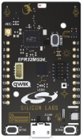

# Prerequired

[Simplicity Studio v5.](https://www.silabs.com/developer-tools/simplicity-studio)

Latest OpenThread SDK and SiSDK [2024.12.0 or later](https://github.com/SiliconLabs/simplicity_sdk/tree/sisdk-2024.12/protocol/openthread)  is prefered.

[EFR32MG21/24/26](https://www.silabs.com/wireless/thread) or modules should be used.

example is provided has been tested on [xG24-DK2601B ](https://www.silabs.com/development-tools/wireless/efr32xg24-dev-kit?tab=overview)(EFR32MG24 developper kit).

