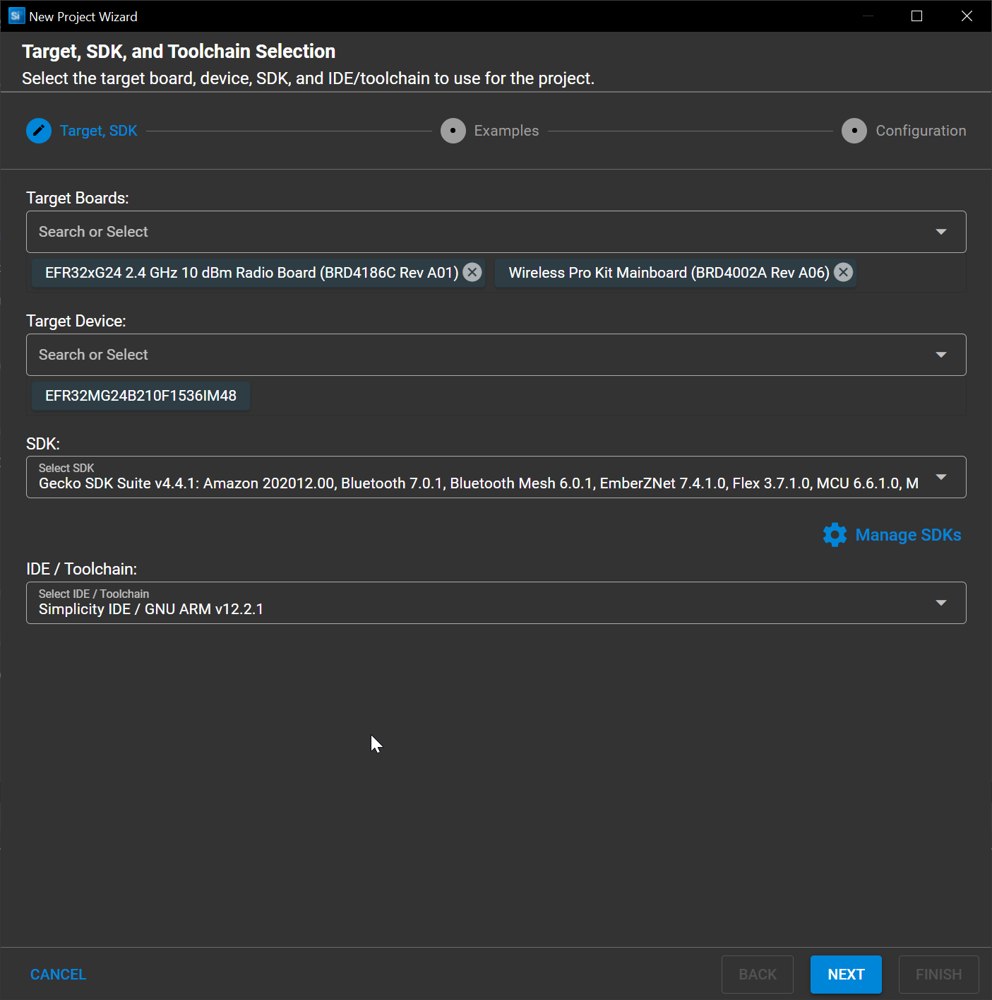
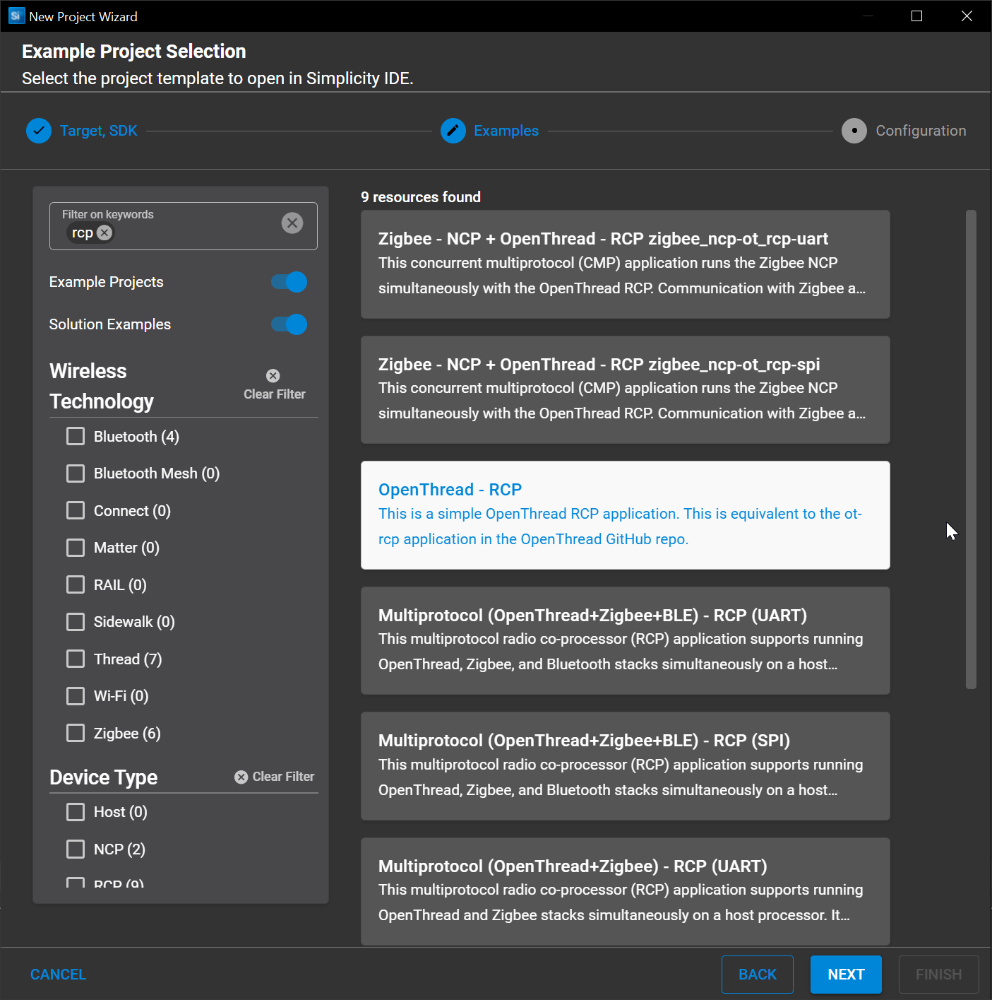
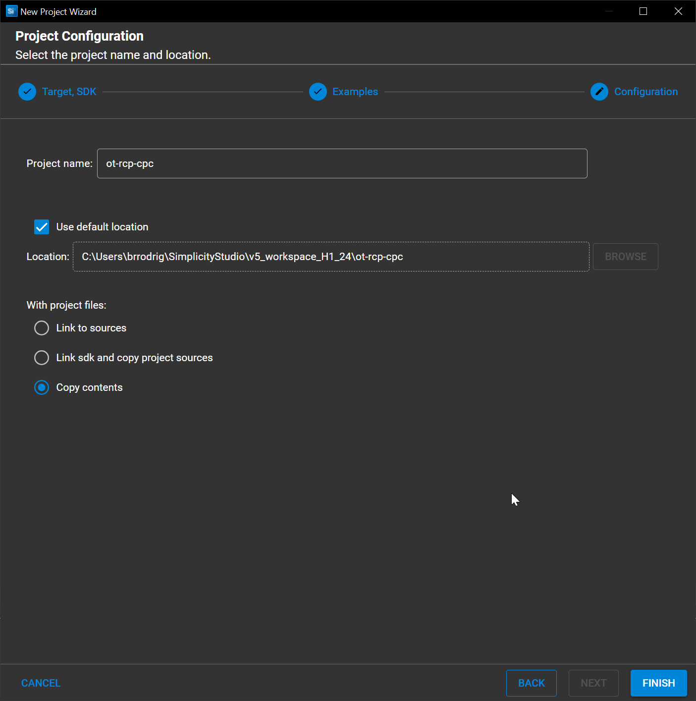
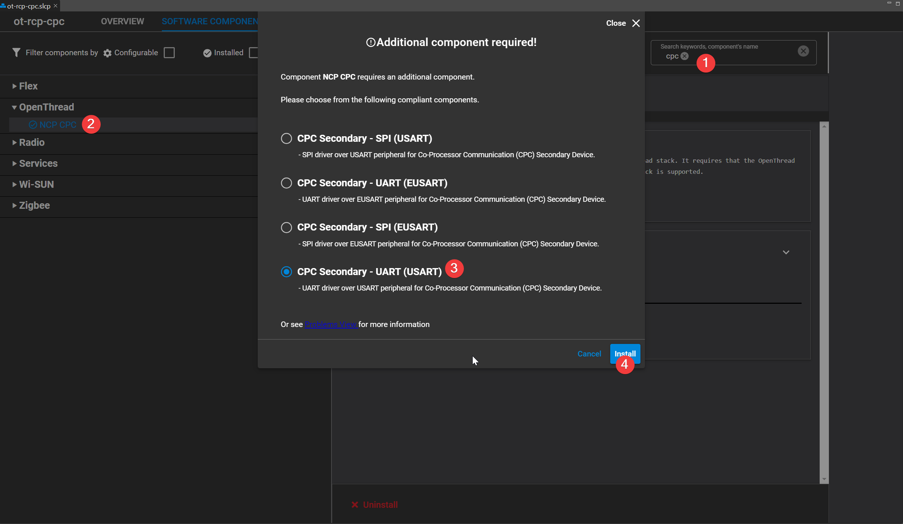
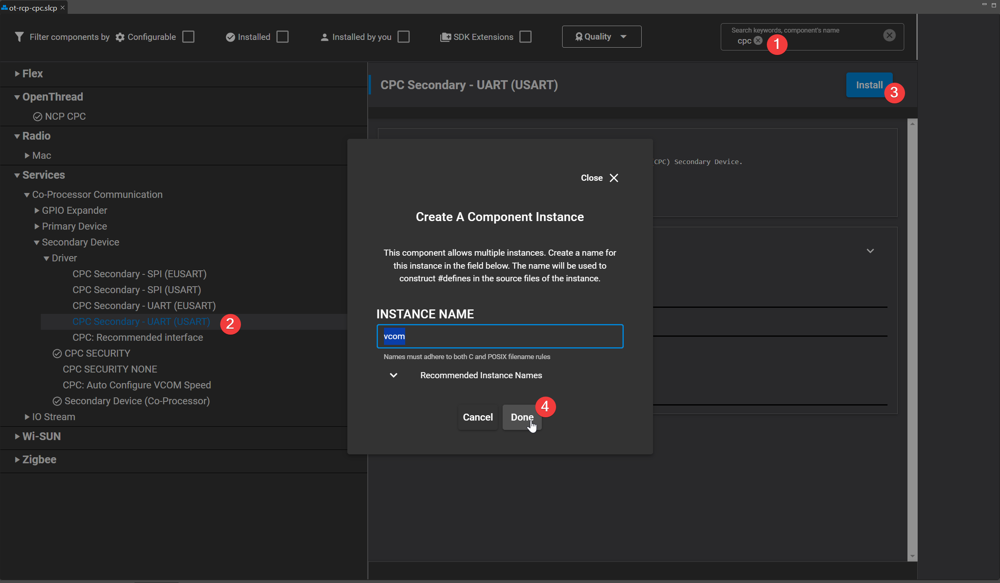

# CPC Application Project Creation and Configuration

## OpenThread RCP (Single Protocol) project creation

TODO1 : Move this to OT repo, and add a dedicated CPC related section

TODO2 : Create Zigbee NCP over CPC dedicated repo

1. Plug-in your radio board + dev kit to your computer
2. Open `Simplicity Studio > File > New > Silicon Labs Project Wizard`
3. If your radio board was plugged in and GSDK installed, you should have all fields pre-filled.

   Otherwise just customize the project base settings accordsing to your needs

   

   In this case we will be using a `BRD4186C` radio board
4. On the subsequent screen select `OpenThread - RCP`

   This will create an OpenThread RCP project with bootloader support (LinkerFile will leave 0x6000 sapece for it)

   

   Click Next
5. Rename your project as you whish

   

   If you wish to, you can also set your project to copy all sources from the Gecko SDK locally upon configuration

   This allows for easier versioning but complexifies import/export
6. Click Finish to proceed with project creation

## OpenThread RCP (Single Protocol) project configuration

There is no sample application provided by Silicon Labs to support only OpenThread over CPC. It is therefore required to customize the original `ot-rcp` project to redirect the `SPINEL` traffic over CPC.

The modification will occur on the .SLCP file :

Remove the following components :

* UARTDRV USART Instance : vcom

Add the following cmponents :

* NCP CPC (From the OpenThread section) :

In case the vcom instance does not get installed manually add it as follows :

Once done, the RCP application can simply be built and flashed on top of a bootloader .
