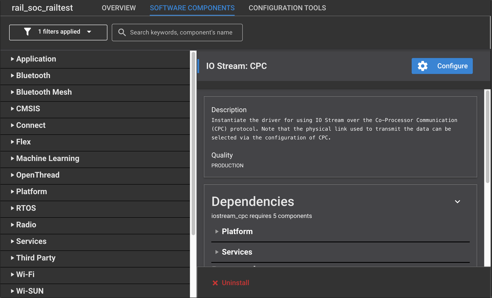
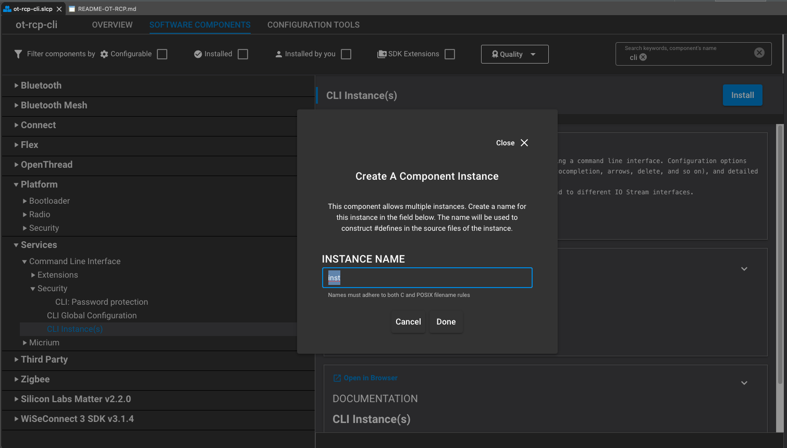
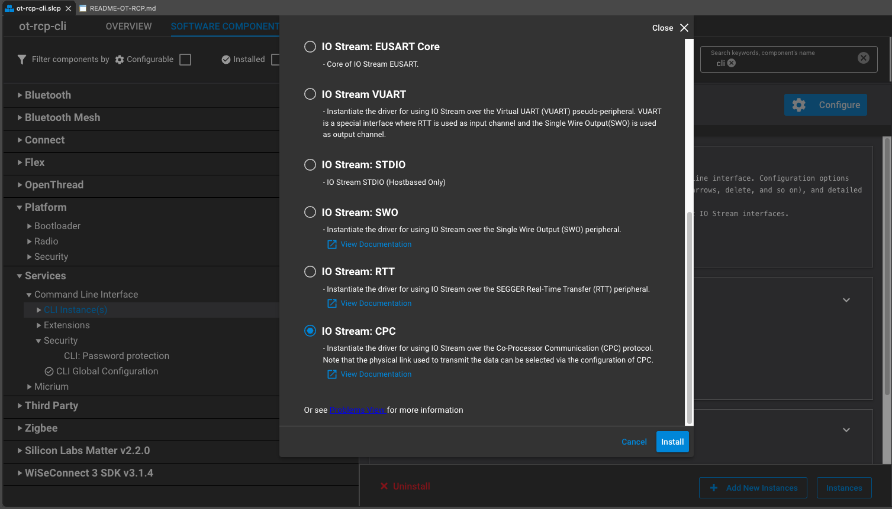
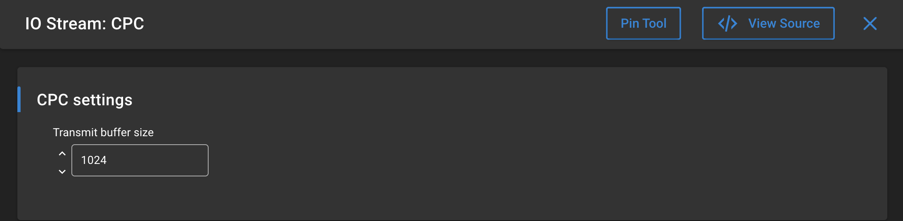

## Modification to add CPC 

1. Select the project file (.slcp)
2. go to the Software Components view



3. install CLI instance(s) and add as well IO Stream: CPC as you are asked for an IO Stream component addition

   

   
4. in IO Stream: CPC component configuration increase the transmit buffer size to 1024 at least so that the command responses won't get truncated.

   
5. open sl_cli_config_inst.h in the config directory of your project and modify line 110 as:

```c
   #define SL_CLI_INST_IOSTREAM_HANDLE    sl_iostream_cpc_handle
```

6. Then we need to add some CLI commands to test. Read [Cli Service documentation](https://docs.silabs.com/gecko-platform/4.4.1/platform-service-cli-overview/) for more info

   in app.c #include section add:

   ```c
   #include "sl_cli.h"
   #include "sl_cli_config_inst.h"
   ```
   in app.c add the following functions:

   ```c
   // Create command handlers for the commands
   void echo_str(sl_cli_command_arg_t *arguments)
   {
     char *ptr_string;

     for (int i = 0; i < sl_cli_get_argument_count(arguments); i++) {
       ptr_string = sl_cli_get_argument_string(arguments, i);

     }
   }

   void echo_int(sl_cli_command_arg_t *arguments)
   {
     int8_t argument_value;

     for (int i = 0; i < sl_cli_get_argument_count(arguments); i++) {
       argument_value = sl_cli_get_argument_int8(arguments, i);

     }
   }


   // Create command details for the commands. The macro SL_CLI_UNIT_SEPARATOR can be
   // used to format the help text for multiple arguments.
   static const sl_cli_command_info_t cmd__echostr = \
     SL_CLI_COMMAND(echo_str,
                    "echoes string arguments to the output",
                    "Just a string...",
                    {SL_CLI_ARG_WILDCARD, SL_CLI_ARG_END, });

   static const sl_cli_command_info_t cmd__echoint = \
     SL_CLI_COMMAND(echo_int,
                    "echoes integer arguments to the output",
                    "Just a number...",
                    {SL_CLI_ARG_INT8, SL_CLI_ARG_ADDITIONAL, SL_CLI_ARG_END, });


   // Create the array of commands, containing three elements in this example
   static sl_cli_command_entry_t a_table[] = {
     { "echo_str", &cmd__echostr, false },
     { "echo_int", &cmd__echoint, false },
     { NULL, NULL, false },
   };

   // Create the command group at the top level
   static sl_cli_command_group_t a_group_0 = {
     { NULL },
     false,
     a_table
   };
   ```
   in app.c app_init() function add the following to enable the above CLI commands:

   ```c
   // And finally call the function to install the commands.
   sl_cli_command_add_command_group(sl_cli_default_handle, &a_group_0);
   ```
7. Once you have done all of the above, your project is ready and you can compile and flash it.
