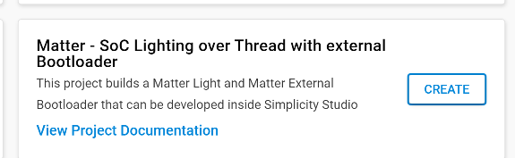
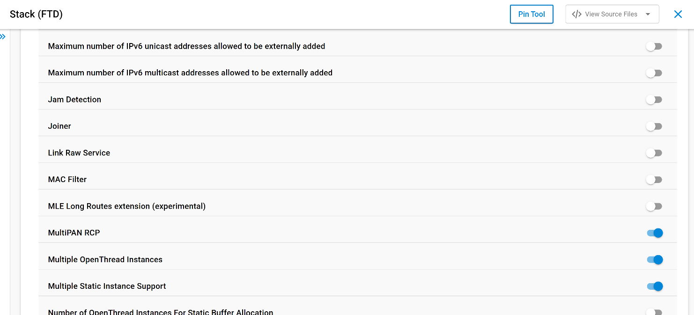

# Project configuration

In this section we will configure a MatterLightOverThread project to support OpenThread Multi-Instance functionality.
- The first Thread instance will be dedicated to the Matter application
- The second Thread instance will be used for COAP proprietary application

Hardware used in this example is [BRD4186C] (https://www.silabs.com/development-tools/wireless/xg24-rb4186c-efr32xg24-wireless-gecko-radio-board?tab=overview)(EFR32MG24 developper kit)


This tutorial is based on SiSDK2024.12.x 
The full project is located [here](https://github.com/seb-fae/MatterLightOverThread_dual_instances)

## 1. Create and modify the MatterLightOverThread project

### 1. First step is to create a MatterLightOverThread project for BRD4186C. 



### 2. Add the following components to the project

* RAIL Utility, DMA
* Logging to RTT (this will replace 'Logging to UART' component)

### 3. Modify the PSA crypto configuration

The **PSA User Maximum Open Keys Count** value of **Platform->Security->PSA Crypto->Configuration** component should be increased to 8:


### 4. Enable the following features in Openthread Stack FTD component:

* MultiPAN RCP
* Multiple OpenThread Instances
* Multiple Static Instance Support
* COAP API



### 5. Define the ***SL_RAIL_UTIL_IEEE802154_FAST_CHANNEL_SWITCHING_ENABLED*** macro in your project configuration. To avoid any issue this should be done for C, C++ and assembler section


### 6. Add openthread-spinel-config.h file to your project

* Create a spinel directory in your project SDK under **util/third_party/openthread/src/lib/**
* Copy the file from the following SDK location **util/third_party/openthread/src/lib/spinel/openthread-spinel-config.h** to the spinel folder you have just created

### 7. Modify the SDK

Two files located under **protocol/openthread/platform-abstraction/efr32/** needs to be modified.
The two modified files and the associated diff file can be found there:

- [flash.c](src/flash.c)
- [radio.c](src/radio.c)
- [diff](src/sdk.diff)

### 8. Modification of OpenThread stack

The following files in the openthread SDK needs to be modified.
At the time being these modifications are either already merged or under merging in the OpenThread official repository.

**Add the otInstanceGetIdx() function:**

* [util/third_party/openthread/src/core/api/instance_api.cpp](src/instance_api.cpp)
* [util/third_party/openthread/include/openthread/instance.h](src/instance.h)

**Fix index computation in multi-instances context:**

* [util/third_party/openthread/src/core/instance/instance.cpp](src/instance.cpp)

**Modifies key storage method in order to store different security contexts:**

* [util/third_party/openthread/src/core/meshcop/dataset_manager.cpp](src/dataset_manager.cpp)
* [util/third_party/openthread/src/core/net/srp_client.cpp](src/srp_client.cpp)
* [util/third_party/openthread/src/core/thread/key_manager.cpp](src/key_manager.cpp)
* [util/third_party/openthread/src/core/crypto/storage.hpp](src/storage.hpp)
* [util/third_party/openthread/src/core/crypto/storage.cpp](src/storage.cpp)


The diff file of all these above modifications can be accessed [here](src/openthread.diff)

### 9. Create the proprietary application

The Matter application uses a first Thread instance. The proprietary application is running COAP on top of a second thread instance. This is how the two Thread instances are declared: 

```c
/* otInstanceInitSingle is used by the Matter framework to declare the first 
 * Thread instance. However when OPENTHREAD_CONFIG_MULTIPLE_INSTANCE_ENABLE is 
 * defined, this function is not defined anymore and we provide here an 
 * alternate definition. 
 */
otInstance *otInstanceInitSingle(void)
{
   return otInstanceInitMultiple(0);
}

void ProprietaryThreadTaskMain(void * pvParameter)
{
    OT_UNUSED_VARIABLE(pvParameter);

    const TickType_t xDelay = 50;

    myOtInstance = otInstanceInitMultiple(1);

    OT_ASSERT(myOtInstance!= NULL);

    /* Move CLI to Proprietary Thread instance */
    otAppCliInit(myOtInstance);

    while (!otSysPseudoResetWasRequested())
    {
        // Acquire mutex for stack access
        sl_ot_rtos_acquire_stack_mutex();

        // Process callbacks and tasklets
        otSysProcessDrivers(myOtInstance);
        otTaskletsProcess(myOtInstance);

        // Release the stack mutex
        sl_ot_rtos_release_stack_mutex();

        vTaskDelay( xDelay );
    }
}

````

The second Thread instance can receive and send COAP message as described in the following [COAP example](../OpenThread_Coap_example/).
The whole application file is located [here](src/SecondaryApp.cpp)

In this example the COAP ressource has been linked to the Matter OnOff attribute. In that way, both Matter and COAP interfaces can drive the light of the example. This implies some modifications to the basic Matter Light example like the creation of an additionnal event tied to COAP interface that can trigger the light. The two modified files are and the associated diff files are provided here:

* [src/AppTask.cpp](src/AppTask.cpp)
* [include/AppEvent.h](src/AppEvent.h)
* [include/AppTask.h](src/AppTask.h)
* [diff](src/app.diff)


At this point you can compile the example and flash it to the BRD4186C. Don't forget to add a bootloader in addition to this application.
