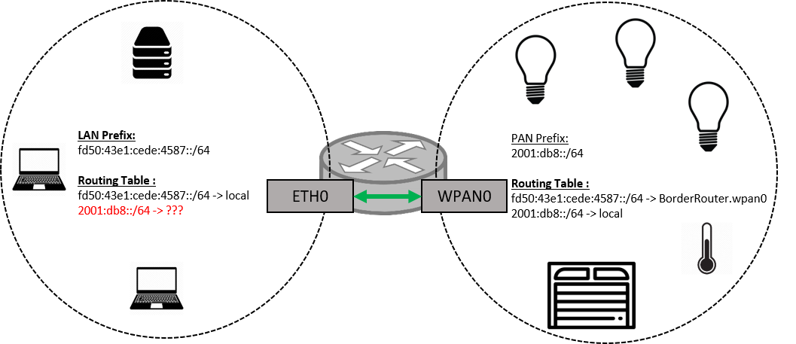
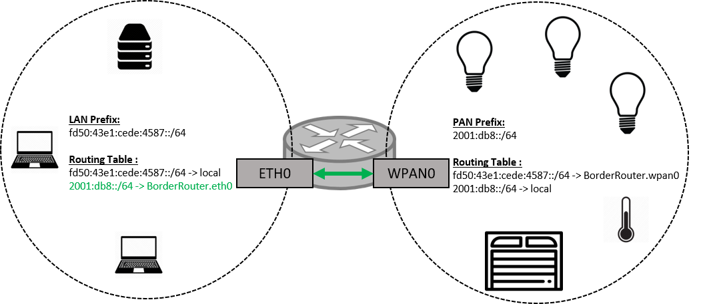

# Ipv6 Routing across interfaces

## Enabling Linux kernel's IPv6 forwarding 
Now that we have IPv6 addresses on the eth0 interface, we need to allow our router to forward packets accross its interfaces
Here we're going to use it to forward packets between eth0 and wpan0 (which is where our Thread network is)

Process is simple:

```console
 echo 1 > /proc/sys/net/ipv6/conf/all/forwarding
```

You can *cat* that value to make sure it went just fine :

```console
 cat /proc/sys/net/ipv6/conf/all/forwarding
```
It should return :
```console
1
```

## Defining static Global addresses to our interfaces

This is touching one IPv6 feature that I will not cover much in this guide:

IPv6 defines several addresses scopes (i.e. global, link local) that are not necessarily part of routing
In order to allow packets to be routed accross interfaces, the addresses *scopes* that we use need to be global

* On the eth0 side :
  If you use the ot-br-posix install, your local DHCP client will get you an IPv6 address automatically
  If not in this context, or if you want to statically add an address to eth0 :

  ```console
  sudo ip addr add dev eth0 fd50:43e1:cede:4587::abcd/64
  ```
  This will add a static address to your eth0 interface, make sure that you use the same prefix and mask as in the radvd configuration

* On the wpan0 side
  To get a global IPv6 address on the wpan0 interface you will need to use the ot-ctl agent that runs on the Border Router
  ```console
  sudo ot-ctl prefix add 2001:db8::/64 paros
  ```
  Here we added the global prefix 2001:db8::/64


Use *ip a* to check that your interfaces have the correct addresses
```console
ip a
```

At this point:
  * Your border router can ping any Thread device
  * Any thread device can ping your border router
  * However no device on the same LAN as eth0 can ping a Thread device





## Advertising a route to our Thread network on eth0
We reached a state where our Router exists on both networks
However, we would like to reach our Thread devices directly from our Smartphone/Computer/WiFi devices

*Why can't our LAN devices reach our Thread network ?*
As you can see on the above figure, our devices connected to the LAN are outside our router
Therefore they cannot know that there is a network prefixed 2001:db8::/64 connected to it

-> We need to provide our LAN a route so devices on it can know where to send packets with destination 2001:db8::/64 to

As you might see in many tutorials we could have simply add a route manually in our devices' routing tables
Unfortunately, you do not always have enough privileges to do that (on your phone for example)
The solution to this is to take advantage of one of IPv6's features called Neighbor Discovery Protocol (NDP)

And again radvd will be our best fit here:

* Open radvd's configuration file at */etc/radvd.conf*
* Within the eth0 configuration, add a new entry called route as follows:
  ```sh
  route 2001:db8::/64
  {
  };
  ```

  The final file should now look like this :
  ```sh
  interface eth0
  {
    AdvSendAdvert on; 
    MaxRtrAdvInterval 30; 
    AdvManagedFlag on; 
    AdvOtherConfigFlag on;

    prefix fd50:43e1:cede:4587::/64
    {
                  AdvOnLink on;
                  AdvAutonomous on;
    };

    route 2001:db8::/64
    {
    };

  };
  ```
* Restart the daemon :
  ```console
  sudo systemctl stop radvd.service
  sudo systemctl start radvd.service
  ```

At this point, radvd will also be advertising the route to our Thread interface on eth0
This will allow all our devices on our LAN to communicate with the Thread devices

