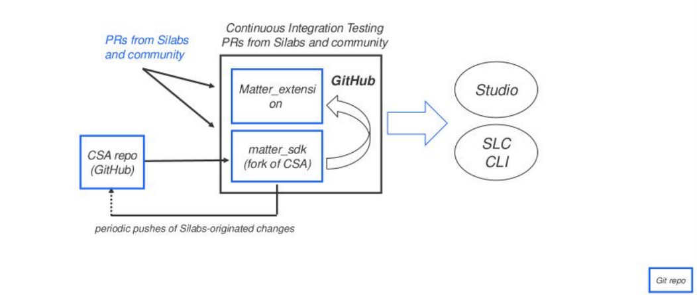

# Matter development with Silicon Labs

## Introduction

This guide provides guidance as to where developers can start implmenting Matter firmwares for Silicon Labs MCUs

## Matter Software Sources

Matter on Silicon Labs can be imlpemented from 3 sources :

* Matter CSA Repository : [https://github.com/project-chip/connectedhomeip](https://github.com/project-chip/connectedhomeip)
* Silicon Labs Matter Extension with SLC-CLI : [https://github.com/SiliconLabsSoftware/matter_extension/](https://github.com/SiliconLabsSoftware/matter_extension/)
* Silicon Labs Matter Extension with Simplicity Studio

## Technical Support strategies

Using the CSA repo offers the most flexibility as to reporting bugs, fixing it and integrating the latest up to date library code

However, Silicon Labs offers limited support of their platforms on the CSA repo codebase

On the other hand, SiliconLabs offers comprehensive Technical Support to customers using Silicon Labs Matter extension (either with SLC-CLI or Simplcicity Studio)

The drawback here is that customers have limited options to quickly fix and intake latest code from the CSA repository

## Getting started with each option

* CSA Repo and documentation is centralized in [https://github.com/project-chip/connectedhomeip](https://github.com/project-chip/connectedhomeip)
* Silicon Labs matter extension repo to be used with SLC-CLI is located in [https://github.com/SiliconLabsSoftware/matter_extension/](https://github.com/SiliconLabsSoftware/matter_extension/)
  Access and documentation of slc-cli usage is dosumented in the README.md file
* As for Matter through Simplicity Studio, getting started is located here : [https://www.silabs.com/wireless/matter/matter-developer-journey](https://www.silabs.com/wireless/matter/matter-developer-journey)
